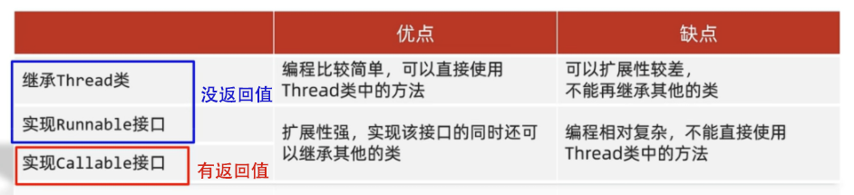
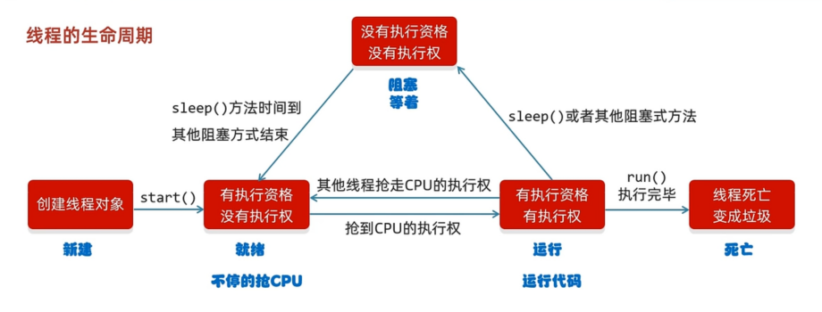

# 多线程

## 多线程的创建方法

### 1. 继承 Thread

1. 定义一个类继承 Thread
2. 重写 run 方法
3. 创建子类对象，并启动线程

### 2. 实现 Runnable 接口

1. 自己定义一个实现 Runnable 接口
2. 重写里面的 run 方法
3. 创建自己类的对象（可以称为任务类）
4. 创建一个 Thread 类的对象，传入任务类，并开启线程

### 3. 实现 Callable 接口

特点：可以获取到多线程运行的结果。

1. 创建一个类 MyCallable 实现 Callable 接口

2. 重写 call （是有返回值的，表示多线程运行的结果）

   

3. 创建 MyCallable 的对象（表示多线程要执行的任务）

4. 创建 FutureTask 的对象（作用管理多线程运行的结果）

5. 创建 Thread 类的对象（表示线程），传入 FutureTask 的对象，并启动

## 三种多线程创建方法的对比

## 方法

| 方法名                            | 说明                                                         |
| :-------------------------------- | :----------------------------------------------------------- |
| void start()                      | 线程开始                                                     |
| String getName()                  | 返回此线程的名称（线程有默认名：Thread-{idx}，idx 从 0 开始编号） |
| void setName(String name)         | 设置线程的名字（构造方法也可以设置名字）                     |
| **static** Thread currentThread() | 获取当前线程的对象                                           |
| **static** void sleep(long time)  | 让**当前**线程休眠指定时间，单位为毫秒（ms）                 |
| void setPriority(int newPriority) | 设置线程的优先级（优先级不是绝对的，只是概率问题）           |
| int getPriority()                 | 获取线程的优先级                                             |
| void setDaemon(boolean on)        | 设置为守护线程                                               |
| **static** void yield()           | 出让线程 / 礼让线程                                          |
| void join()                       | 插入线程 / 插队线程                                          |

### 守护线程

当其它的非守护线程执行完毕后，守护线程会**陆续**结束（不是立即结束，还会跑几步）。 

### 礼让线程

表示从当前线程出让当前 CPU 的执行权。

### 插队线程

表示把调用的这个线程插入到当前线程之前，在这个线程执行完毕之前当前线程都会等待。

## 线程的生命周期

## 线程池

### 线程池主要核心原理

1. 创建一个池子，池子中是空的。
2. 提交任务时，池子会创建新的程对象，任务执行完毕，线程归还给池子，下回再次提交任务时，不需要创建新的线程，直接复用已有的线程即可。
3. 但是如果提交任务时，池子中没有空闲线程，也无法创建新的线程，任务就会排队等待。

### 线程池代码实现

Executors 是线程池的工具类，通过调用方法返回不同类型的线程池对象。

| 方法名称                                                     | 说明                     |
| ------------------------------------------------------------ | ------------------------ |
| public static ExecutorService newCachedThreadPool()          | 创建一个没有上限的线程池 |
| public static ExecutorService newFixedThreadPool(int nThreads) | 创建有上限的线程池       |

## 拓展知识

在 run 方法中可以调用 Thread.currentThread() 来获取正在运行该函数的线程对象，这样就可以实施对线程对象的操作。

当 JVM 虚拟机启动之后，会自动的启动多条线程，其中有一条线程就叫做 main 线程，他的作用就是去调用 main 方法，并执行里面的代码，在以前，我们写的所有的代码，其实都是运行在 main 线程当中。

