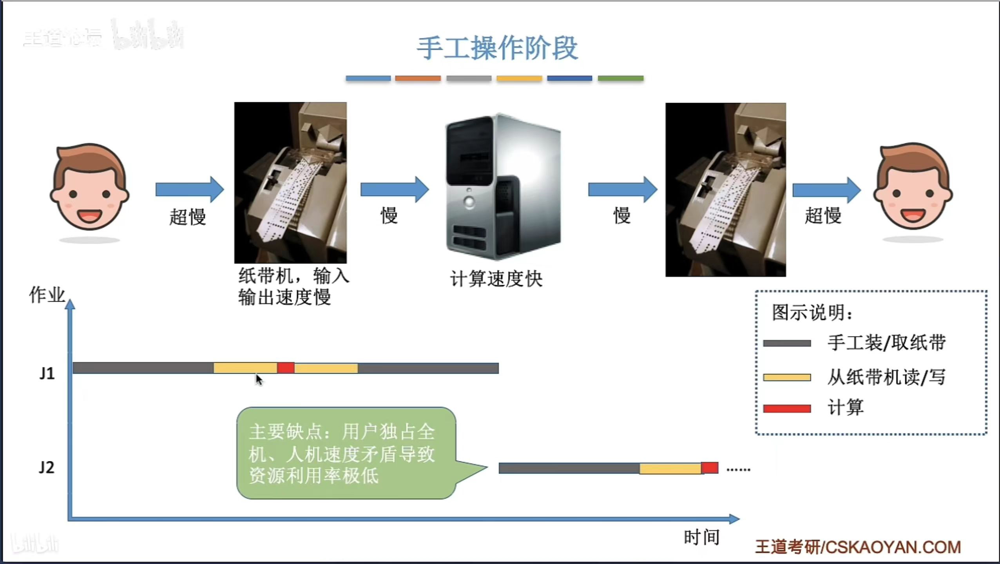

# 第一章

## 操作系统的概念和功能

操作系统（OperatingSystem, OS）是指控制和**管理**整个计算机系统的**硬件和软件**资源，并合理地组织调度计算机的工作和资源的分配；以**提供**给用户和其他软件方便的**接口和环境**；它是计算机系统中最基本的**系统软件**。

即操作系统：

1. 是系统资源的管理者
2. 向上层提供方便易用的服务
3. 是最接近硬件的一层软件

### 管理系统资源

操作系统作为系统资源的管理者，提供的功能有：

1. 文件管理
2. 存储器管理
3. 处理机管理
4. 设备管理

例如，用 QQ 和朋友视频聊天的过程:

1. 在各个文件夹中找到 QQ 安装的位置，如 D:/Tencent/aa/Bin（逐层打开文件夹，找到 QQ.exe 这个程序（可执行文件）的存放位置）（文件管理）
2. 双击打开 QQ.exe （需要把该程序相关数据放入内存）（存储器管理）
3. QQ 程序正常运行（对应的进程被处理机（CPU）处理）（处理机管理）
4. 开始和朋友视频聊天（需要奖摄像头设备分配给进程）（设备管理）

### 向上层提供方便易用的服务

封装思想：操作系统把一些丑陋的硬件功能封装成简单易用的服务，使用户能更方便地使用计算机，用户无需关心底层硬件的原理，只需要对操作系统发出命令即可。

#### GUI 图形化用户接口

GUI（Graphical User Interface）

用户可以使用形象的图形界面进行操作，而不再需要记忆复杂的命令、参数。

例子：在 Windows操作系统中，删除一个文件只需要把文件“拖拽”到回收站即可。

#### 联机命令接口

联机命令接口，也称交互式命令接口，是用户与系统进行实时交互的方式，特点是用户说一句，系统跟着做一句。

例子：windows 上的 cmd。

#### 脱机命令接口

脱机命令接口是用户编写脚本或批处理命令，系统在稍后或特定条件下执行，特点是用户说一堆，系统跟着做一堆。

例子：windows 上的 .bat 文件。

#### 程序接口

程序员可以在程序中进行系统调用来使用程序接口。普通用户不能直接使用程序接口，只能通过程序代码间接使用。

例子：写 C 语言“Hello world”程序时，在 printf 函数的底层就使用到了操作系统提供的相关“系统调用”。

### 对硬件机器的扩展

没有任何软件支持的计算机成为**裸机**。

在裸机上安装的操作系统，可以提供资源管理功能和方便用户的服务功能，将裸机改造成功能更强、使用更方便的机器。

通常把覆盖了软件的机器成为**扩充机器**，又称之为**虚拟机**（？可能是另一种定义，指通过软件扩展了硬件功能的计算机）。

## 操作系统的特征

没有并发和共享，就基本用不上虚拟和异步，因此并发和共享是操作系统的两个最基本的特征。

### 并发

**并发**指两个或多个事件在同一时间间隔内发生。这些事件**宏观上是同时发生**的，但**微观上是交替发生**的。

**操作系统的并发性**指计算机系统中“同时”运行着多个程序，这些程序宏观上看是同时运行着的，而微观上看是交替运行的。

常考易混概念 —— **并行**：指两个或多个事件在同一时刻同时发生。

操作系统就是伴随着“多道程序技术”而出现的。因此，**操作系统和程序并发是一起诞生的**。

**注意：**

**单核 CPU** 同一时刻只能执行一个程序，各个程序只能**并发**地执行。

**多核 CPU** 同一时刻可以同时执行多个程序，多个程序可以**并行**地执行。
（即使是对于 4 核 CPU 来说，只要有 4 个以上的程序需要“同时”运行，那么并发性依然是必不可少的，因此**并发性是操作系统一个最基本的特性**）

### 共享

**共享**即资源共享，是指系统中的资源可供内存中多个并发执行的进程共同使用。

**两种资源共享方式**：

1. **互斥共享方式**：系统中的某些资源，虽然可以提供给多个进程使用，但一个时间段内只允许一个进程访间该资源。
2. **同时共享方式**：系统中的某些资源，允许一个时间段内由多个进程<a title="所谓的“同时”往往是宏观上的，而在微观上，这些进程可能是交替地对该资源进行访问的(即分时共享)" href="#same time" id="back same time">“同时”</a>对它们进行访间。

**生活实例**:

* 互斥共享方式:使用 QQ 和微信视频。同一时间段内摄像头只能分配给其中一个进程。
* 同时共享方式:使用 QQ 发送文件 A，同时使用微信发送文件 B。宏观上看，两边都在同时读取并发送文件说明两个进程都在访问硬盘资源，从中读取数据。微观上看，两个进程是交替着访问硬盘的。

**并发性和互享性互为存在条件**：

* 如果失去并发性，则系统中只有一个程序正在运行，则共享性失去意义。

* 如果失去共享性，则 QQ 和微信不能同时访问硬盘资源，就无法实现同时发送文件，则并发性无法实现。

### 虚拟

**虚拟**是指把一个物理上的实体变为若干个逻辑上的对应物。物理实体(前者)是实际存在的，而逻辑上对应物(后者)是用户感受到的。

**例如**：GTA5 需要 4GB 的运行内存，浏览器需要 1GB 内存，QQ 需要 256MB 的内存，网易云音乐需要 256MB 的内存，我的电脑只有 4GB 内存，而这些程序同时运行需要的内存远大于4GB，但它们依旧可以在我的电脑上同时运行，这就是虚拟存储器技术，实际只有 4GB 的内存，在用户看来似乎远远大 4GB。

虚拟技术包括：

1. 空分复用技术(如虚拟存储器技术)
2. 时分复用技术(如虚拟处理器)

显然，如果失去了并发性，则一个时间段内系统中只需运行一道程序，那么大部分情况下都会失去实现虚拟性的意义。

### 异步

**异步**是指，在多道程序环境下，允许多个程序并发执行，但由于资源有限，进程的执行不是一贯到底的，而是走走停停，以不可预知的速度向前推进（因为并发的程序会争抢系统资源），这就是进程的异步性。

如果失去了并发性，即系统只能串行地运行各个程序，那么每个程序的执行会一贯到底。只有系统拥有并发性，才有可能导致异步性。

## 操作系统的发展与分类

### 手工操作阶段

计算机发展早期，用户需要直接操作计算机硬件，如开关、按钮等，来执行指令和程序的阶段。

主要缺点：用户独占全机、人机速度矛盾导致资源利用率极低。

### 批处理阶段

#### 单道批处理系统

引入脱机输入/输出技术，并由监督程序（操作系统的雏形）负责控制作业的输入、输出。系统一次只能加载一个作业，按顺序执行作业队列中的程序，直到当前作业完成后才加载下一个作业。

主要优点：缓解了一定程度的人机速度矛盾，资源利用率有所提升。

主要缺点：内存中仅能有一道程序运行，只有该程序运行结束之后才能调入下一道程序。CPU 有大量的时间是在空闲等待 I/O 完成。资源利用率依然很低。

#### 多道批处理系统

每次往内存中读入多道程序，CPU 和 I/O 设备一次只执行一个作业，通过作业调度和资源管理来提高CPU的利用率和系统的吞吐量。

操作系统正式诞生，用于支持多道程序并发运行。

主要优点：多道程序并发执行，**共享**计算机资源。资源利用率大幅提升，CPU和其他资源更能保持“忙碌”状态，系统吞吐量增大。

### 分时操作系统

计算机以时间片为单位轮流为各个用户/作业服务，各个用户可通过终端与计算机进行交互。

主要优点：用户请求可以被即时响应，解决了人机交互问题。允许多个用户同时使用一台计算机，并且用户对计算机的操作相互独立，感受不到别人的存在。

主要缺点：不能优先处理一些紧急任务。操作系统对各个用户/作业都是完全公平的，循环地为每个用户作业服务一个时间片，不区分任务的紧急性。

### 实时操作系统

在实时操作系统的控制下，计算机系统接收到外部信号后及时进行处理，并且要在严格的时限内处理完事件。实时操作系统的主要特点是及时性和可靠性。

主要优点：能够优先响应一些紧急任务，某些紧急任务不需时间片排队。

1. 硬实时系统：必须在绝对严格的规定时间内完成处理，如导弹控制系统、自动驾驶系统。
2. 软实时系统：能接受偶尔违反时间规定，如 12306 火车订票系统。

### 其它几种操作系统

#### 网络操作系统

是伴随着计算机网络的发展而诞生的，能把网络中各个计算机有机地结合起来，实现数据传送等功能，实现网络中各种资源的共享(如文件共享)和各台计算机之间的通信。(如： Windows NT 就是一种典型的网络操作系统，网站服务器就可以使用)

#### 分布式操作系统

主要特点是分布性和并行性。系统中的各台计算机地位相同，任何工作都可以分布在这些计算机上，由它们并行、协同完成这个任务。

#### 个人计算机操作系统

如 Windows XP、MacOS，方便个人使用。

## 操作系统的运行机制

### 内核程序 vs 应用程序

我们普通程序员写的程序就是“**应用程序**”。

微软、苹果有一帮人负责实现操作系统，他们写的是“**内核程序**”。

由很多内核程序组成了“**操作系统内核**”，或简称“**内核(Kernel)**”。

**内核**是操作系统**最重要最核心**的部分，也是**最接近硬件的部分**，甚至可以说，一个操作系统只要有内核就够了（eg：Docker -> 仅需 Linux 内核）。

操作系统的功能未必都在内核中，如图形化用户界面 GUI 。

### 特权指令 vs 非特权指令

**应用程序**只能使用“**非特权指令**”，如：加法指令、减法指令等。

**操作系统内核**作为“管理者”，有时会让 CPU 执行一些“**特权指令**”，如：内存清零指令。这些指令影响重大，只允许“管理者” —— 即操作系统内核来使用。

程序运行的过程其实就是 CPU 执行一条一条的机器指令的过程，**在 CPU 设计和生产的时候就划分了特权指令和非特权指令**，因此CPU执行一条指令前就能判断出其类型。

那么问题来了，CPU 能判断出指令类型，但是它怎么区分此时正在运行的是内核程序 or 应用程序？答案是通过 CPU 的状态。

### 内核态 vs 用户态

CPU 有两种状态，“**内核态**”和“**用户态**”。

处于**内核态**时，说明此时正在运行的是**内核程序**，此时**可以执行特权指令**。

处于**用户态**时，说明此时正在运行的是**应用程序**，此时**只能执行非特权指令**。

拓展：CPU 中有一个寄存器叫**程序状态字寄存器(PSW)**，其中有个二进制位，1 表示“内核态”，0 表示“用户态”。

别名:内核态=核心态=**管态**；用户态=**目态**。

### 内核态、用户态的切换

**内核态 → 用户态**：执行一条**特权指令** —— **修改 PSW** 的标志位为“用户态”，这个动作意味着操作系统将主动让出 CPU 使用权。

**用户态 → 内核态**：由“**中断**”引发，**硬件自动完成变态过程**，触发中断信号意味着操作系统将强行夺回 CPU 的使用权。

一个故事:

1. 刚开机时，CPU 为“**内核态**”，操作系统内核程序先上 CPU 运行。
2. 开机完成后，用户可以启动某个应用程序。
3. 操作系统内核程序在合适的时候主动让出 CPU，让该应用程序上 CPU 运行，操作系统内核在让出 CPU 之前，会**用一条特权指令把 PSW 的标志位设置为“用户态”**。
4. 应用程序运行在“用户态”。
5. 此时，一位猥琐黑客在应用程序中植入了一条特权指令，企图破坏系统...
6. CPU 发现接下来要执行的这条指令是特权指令，但是自己又处于“用户态”。
7. 这个非法事件会引发一个**中断信号**，**CPU 检测到中断信号后**，会立即变为“**核心态**”，并停止运行当前的应用程序，转而运行处理中断信号的内核程序。
8. “中断”使操作系统再次夺回 CPU 的控制权。
9. 操作系统会对引发中断的事件进行处理，处理完了再把 CPU 使用权交给别的应用程序。

除了非法使用特权指令之外，还有很多事件会触发中断信号。一个共性是，**但凡需要操作系统介入的地方，都会触发中断信号**。

## 中断和异常

### 中断的作用

在合适的情况下，操作系统内核会把 CPU 的使用权主动让给应用程序。

“**中断**”是**让操作系统内核夺回 CPU 使用权**的唯一途径。

如果没有“中断”机制，那么一旦应用程序上 CPU 运行，CPU 就会一直运行这个应用程序，就无法实现并发。

### 中断的类型

中断分为内中断（也称“异常”）和外中断。

### 内中断

内中断与当前执行的指令**有关**，中断信号来源于 CPU **内部**。

若当前执行的指令是非法的，则会引发一个中断信号。

* 例子1：试图在用户态下执行特权指令。

* 例子2：执行除法指令时发现除数为 0 。
* 例子3：有时候应用程序想请求操作系统内核的服务，此时会执行一条特殊的指令 —— 陷入指令，该指令会引发一个内部中断信号。执行“陷入指令”，意味着应用程序主动地将 CPU 控制权还给操作系统内核。“系统调用”就是通过陷入指令完成的。

### 外中断

外中断与当前执行的指令**无关**，中断信号来源于 CPU **外部**。

* 例子1：时钟中断 —— 由时钟部件发来的中断信号。时钟部件每隔一个时间片(如 50ms)会给 CPU 发送一个时钟中断信号，操作系统夺回控制权决定是否切换进程，以此来实现并发。
* 例子2：IO 中断 —— 由输入/输出设备发来的中断信号。当输入输出任务完成时，外部设备向 CPU 发送中断信号，通知自己的任务完成，这样 CPU 可以从其他任务中被唤醒来处理这次 I/O 操作的结果，而不用效率低下的去不断地轮询每个 I/O 设备来检查它们的状态。

### 中断的分类

**内中断**（也称**异常**，例外），分为：

* **陷阱、陷入（trap）**：由陷入指令引发，是应用程序故意引发的， 
* **故障（fault）**：由错误条件引起的，可能被内核程序修复。内核程序修复故障后会把 CPU 使用权还给应用程序，让它继续执行下去。如：缺页故障。
* **终止（abort）**：由致命错误引起，内核程序无法复该错误，因此一般不再将 CPU 使用权还给引发终止的应用程序，而是直接终止该应用程序。如：非法使用特权指令，内存条损坏导致的数据读写错误，整数除 0 并且程序没有捕获该异常。
* ...

**外中断**（也称“**中断**”），分为：

* 时钟中断
* I/O 中断请求
* ...

*大多数的教材、试卷中，“中断”特指狭义的中断，即外中断。而内中断一般称为“异常”*。

### 中断机制的基本原理

**不同的中断信号，需要用不同的中断处理程序来处理**。当 CPU 检测到中断信号后，会根据中断信号的类型去查询“**中断向量表**”，以此来找到相应的中断处理程序在内存中的存放位置。

## 系统调用

### 什么是系统调用?

操作系统作为用户和计算机硬件之间的接口，需要向上提供一些简单易用的服务。主要包括命令接口和程序接口。其中，**程序接口**由一组**系统调用**组成。

**“系统调用”是操作系统提供给应用程序（程序员）使用的接口**，可以理解为一种可供应用程序调用的特殊函数，**应用程序可以通过系统调用来请求获得操作系统内核的服务**。

### 系统调用与库函数的区别

不涉及系统调用的库函数：如“取绝对值”函数。

涉及系统调用的库函数：如“创建一个新文件”函数。

### 为什么系统调用是必须的?

**生活场景:**

去学校打印店打印论文，你按下了 WPS 的“打印”选项，打印机开始工作。

你的论文打印到一半时，另一位同学按下了 Word 的“打印”按钮，开始打印他自己的论文。

如果两个进程可以随意地、并发地共享打印机资源，打印机设备就会交替地收到 WPS 和 Word 两个进程发来的打印请求，结果两篇论文的内容混杂在一起了…

**解决方法:**

由操作系统内核对**共享资源**进行统一的管理，并向上提供“系统调用”，用户进程想要使用打印机这种共享资源，只能通过系统调用向操作系统内核发出请求。内核会对各个请求进行**协调处理**。

即：

应用程序通过**系统调用**请求操作系统的服务。而系统中的各种共享资源都由操作系统内核统一掌管，因此**凡是与共享资源有关的操作**(如存储分配、I/O 操作、文件管理等)，**都必须通过系统调用的方式向操作系统内核提出服务请求**，由操作系统内核代为完成。这样可以**保证系统的稳定性和安全性**，防止用户进行非法操作。

### 系统调用的过程

传递系统调用参数 → 执行陷入指令(**用户态**) → 执行相应的内请求核程序处理系统调用(**核心态**) → 返回应用程序

注意：

1. **陷入指令**是在**用户态**执行的，执行陷入指令之后立即引发一个**内中断**，使 CPU 进入**核心态**。
2. 发出系统调用请求是在用户态，而对系统调用的相应处理在核心态下进行。
3. 别名：陷入指令 = trap 指令 = 访管指令

## 操作系统体系结构

### 操作系统的内核

**内核**是操作系统最基本、最核心的部分。

实现操作系统内核功能的那些程序就是**内核程序**。

**内核**：

* 时钟管理：
  * 利用时钟中断实现计时功能。

* 中断处理：
  * 负责实现中断机制。

* 原语：

  * 是一种特殊的程序。

  * 处于操作系统最底层，是最接近硬件的部分。

  * 这种程序的运行具有原子性 -- 其运行只能一气呵成，不可中断。

  * 运行时间较短、调用频繁。

* 对系统资源进行管理的功能：

  * 进程管理

  * 存储器管理

  * 设备管理

**非内核功能**（如 GUI）：

* 运行在用户态，避免直接访问或操作底层硬件和内存，通过系统调用与内核交互。
* 更关注用户交互和应用逻辑的优化，而非直接管理硬件或系统资源。
* Ubuntu、CentOS 的开发团队，其主要工作是实现非内核功能，而内核都是用 Linux 内核。

 ### 内核分类

按照操作系统内核架构的设计方式分为：

* **大内核**（又名:宏内核/单内核）
* **微内核**
* 分层结构
* 模块化
* 外核

### 大内核和微内核

在内核中，时钟管理、中断处理、原语是与硬件关联较紧密的模块；

而进程管理、存储器管理、设备管理这些管理工作更多的是对数据结构的操作，不会直接涉及硬件。所以有的操作系统并不会把这些功能放入内核当中，因此就引出了两种截然不同的内核的设计方法：按照是否将这些功能算入内核分为了大内核和微内核。

注意:
操作系统**内核**需要运行在**内核态**。

操作系统的**非内核**功能运行在**用户态**。

**一个故事**：

现在，应用程序想要请求操作系统的服务，这个服务的处理同时涉及到进程管理、存储管理、设备管理，两种内核对此的处理方式体现出不同：

注意：**变态的过程是有成本的**，要消耗不少时间，**频繁地变态会降低系统性能**。

**大内核和微内核的优缺点**

**大内核**：

* 将操作系统的主要功能模块都作为系统内核，运行在核心态。
* 优点：高性能。
* 缺点：内核代码庞大，结构混乱，难以维护。
* 典型的**大内核/宏内核/单内核**操作系统：Linux、UNIX 。

**微内核**：

* 只把最基本的功能保留在内核。
* 优点：内核功能少，结构清晰，方便维护。
* 缺点：需要频繁地在核心态和用户态之间切换，性能低。
* 典型的**微内核**操作系统：<a id="back some OS" href="#some OS">QNX、Mach、Symbian、MINIX</a>。

macOS、IOS、Windows NT、鸿蒙（HarmonyOS）等操作系统将将微内核的模块化思想与宏内核的性能结合，可以称为混合内核。

### 其它内核

## 附页

<a id="same time" href="#back same time">“同时”</a>：所谓的“同时”往往是宏观上的，而在微观上，这些进程可能是交替地对该资源进行访问的(即分时共享)。

<a id="some OS" href="#back some OS">QNX、Mach、Symbian、MINIX</a>：

* QNX：实时操作系统，常用于工业和汽车领域，以高可靠性和安全性著称。
* Mach：一种早期的微内核，影响了后来的许多操作系统（例如 macOS 的 XNU 内核基于 Mach）。
* Symbian：曾流行于早期的智能手机市场，采用了微内核架构。
* MINIX：教育性操作系统，由 Andrew Tanenbaum 设计，也是 Linux 的灵感来源之一。
