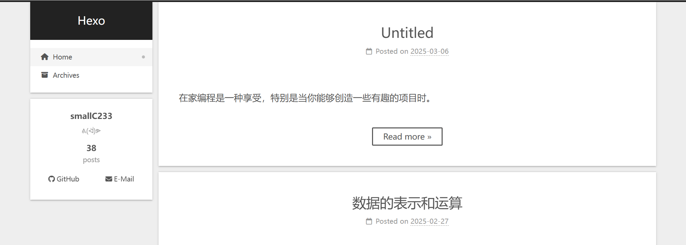

# 博客配置

## 首页显示

### 只显示文章部分内容

使用 `<!-- more -->` 插入到文章中，达成只在首页显示 `<!-- more -->` 上方的内容而非全篇文章的效果。

例如一篇文章：

```markdown
在家编程是一种享受，特别是当你能够创造一些有趣的项目时。
<!-- more -->
接下来，我们将介绍如何使用 Tkinter 创建一个简单的 GUI 应用程序，并探索其中的一些关键概念。
```

在首页显示的效果为：




