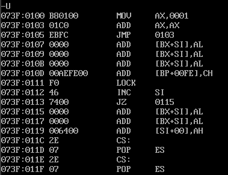

# DEBUG 指令

## R 命令（Read）

1. R：查看 CPU 寄存器的内容
2. R {寄存器名称} > {新值}：查看并改变 CPU 寄存器内容。

## D 命令（Dump）

1. D [起始地址] [查看长度]：查看内存中的内容
2. 只输入 D 会在上次 D 指令查看结束的地址 + 10H 作为起始地址开始显示。

## U 命令（Unassemble - 反汇编）

1. U [起始地址] [查看长度]：将内存中的机器指令翻译成汇编指令。
2. 只输入 U 会在上次 U 指令查看结束的地址 + 10H 作为起始地址开始显示。

## E 命令（Enter）

改写内存中的内容。

1. E  {起始地址} {新值}

2. E {起始地址} {Enter} {新值}

## T 命令（Trace - 追踪）

T：执行一条目前 CS:IP 指向的机器指令，并自动执行一个 R 命令查看 CPU 寄存器的内容，执行完后 IP 自动跳转。

## P 命令（Proceed- 继续）

P：和 T 类似，但是 T 是“单步进入（step in）”，P 是“单步下一行（step over)”。

P 可以正常执行 `INT 21` ，而 T 不行。由于 `INT 21` 是 DOS 系统调用中断，它的处理程序是由 DOS 操作系统管理的，并不总是以常规程序的形式存在于可执行的内存空间中。因此， T 命令可能无法正确地跟踪 `INT 21` 的执行流，而 P 命令由于不进入中断处理程序内部，所以可以执行 `INT 21` 指令本身。

## G 命令（Go）

G [跳转地址]：一直执行到所填地址，不填跳转地址就会一直执行，直至程序结束。

## A 命令（Assemble - 汇编）

A {起始地址} > {汇编指令}：以汇编指令的格式在内存中写入一条机器指令。

