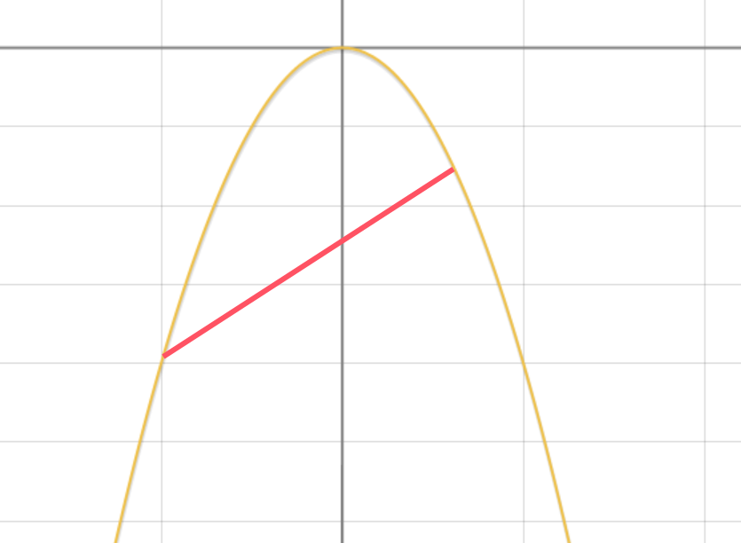
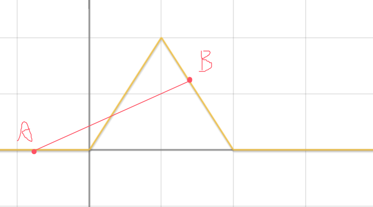

# slope trick

## 是干什么用的？

slope trick 是用来优化 dp 时间复杂度的一种技巧。可以把原本是 $O(n^2)$ 的 dp 转移，通过其是凸函数的性质，利用 map 优化成 $O(n\log{n})$ 。

需要注意的是，Slope Trick 并不是斜率优化，斜率优化的英文是 Convex Hull Trick。


## 算法适用性

一般可以使用 Slope Trick 优化的DP方程有以下要求：

- 是连续的
- 是分段一次函数
- 是凸函数（斜率单调不升，图像上凸）或凹函数

### 什么是凸函数？

从图像来说，就是函数整体呈现上“凸”形状，任意在函数上取两点连线，函数图像总在连线的上方。

例如，$y = -x^2$ 就是凸函数，如图：



而下图函数就不是凸函数，因为任意取两点，函数图像没有全部在连线上方：



从定义上讲，如果对任意的 $x_1, x_2 \in D$ 以及 $\lambda \in [0,1]$，都有：
$$
f(\lambda x_1 + (1 - \lambda) x_2) \leq \lambda f(x_1) + (1 - \lambda) f(x_2)
$$
则称 $f(x)$是 **凸函数**。数学定义在证明时使用，理解不了也不影响你使用这个技巧（

分段一次凸函数具有非常优秀的性质：**两个凸函数相加还是凸函数**。证明意会一下就知道了，本来两个图像都会在两点连线的上方，相加之后自然在更上方。


## 算法思想

选择一个起点 $x_0$（通常是最左端），记录 $f(x_0)$ 和斜率 $k_0$ ，再用 map 记录函数在哪个点斜率变大了多少。

这样我们可以快速维护很多操作：

- 相加：将 $f(x_0),k_0$ 直接相加，斜率变化点的集合直接合并。常用于加一次函数、绝对值函数。
- 取前缀/后缀 $min$：去掉 $k<0$ 或 $k>0$ 的部分。

## 例题
### [P4597 序列](https://www.luogu.com.cn/problem/P4597)

#### 思路

令 $dp[i][j]$ 表示前 $i$ 个元素中，把第 $i$ 个元素变成 $j$ 时，满足题目要求最小所需的代价。

我们可以容易的写出 dp 转移式：
$$
dp[i][j] = MIN_{jj \leq j}{dp[i - 1][jj]} + |j - a[i]|
$$

它是 $O(n^3)$ 的，我们令 $pre\_min[i][j] = MIN_{jj \leq j}{dp[i - 1][jj]}$ ，则:
$$
\begin{aligned}
dp[i][j] = pre\_min[i - 1][j] + |j - a[i]| \\
pre\_min[i][j] = min(pre\_min[i][j - 1],\ dp[i][j])
\end{aligned}
$$
离散化一下就是一个 $O(n^2)$ 的 dp 式子了，但显然对于此题时间复杂度依旧太高。

通过观察我们发现，$pre\_min[i][j]$ 是由 $pre\_min[i - 1][j] + |j - a[i]|$ 求前缀 min 得到的，而它似乎具有凸函数性质，如果真是，那我们就可以带入 slope trick 优化复杂度了。

于是我们具体验证一下，每次考虑 i 不变，于是 $a[i]$ 是定值，当 i = 1 时，$dp[1][j] = |j - a[i]|$ （等价于 $|x - k|$），显然是凸函数，取前缀 min 后依旧是凸函数。当 i > 1 时，$dp[i][j]$ 是两个凸函数相加，结果依旧是凸函数，取 min 也是凸函数，因此 $pre\_min$ 符合我们凸函数的性质，可以直接套用 slope trick 解决问题。

#### 代码

```cpp
#include <bits/stdc++.h>
// #pragma GCC optimize(2)
#define int long long
using namespace std;
#define pii pair<int, int>
const int MAX = 5e5;
const int N = MAX + 10;
const int INF = 1e18, MOD = 998244353;

int a[N];

inline void solve() {
    int n;
    cin >> n;
    for (int i = 1; i <= n; ++i) {
        cin >> a[i];
    }
    // x0 直接取最左边的点
    int x0 = -1e9;
    int y0 = 0, k0 = 0;
    map<int, int> ma;
    for (int i = 1; i <= n; i++) {
        k0 -= 1;
        y0 += abs(x0 - a[i]);
        ma[a[i]] += 2;

        // 取前缀 min
        ma.rbegin()->second -= 1;
        while (!ma.empty() && ma.rbegin()->second == 0) {
            ma.erase(prev(ma.end()));
        }
    }
    int x = x0, y = y0, k = k0;
    for (auto [xx, kk] : ma) {
        y += (xx - x) * k;
        k += kk;
        x = xx;
    }
    cout << y << "\n";
}

signed main() {
#ifdef Local
    freopen("D:/vs/in.txt", "r", stdin);
    // freopen("D:/vs/out.txt","w",stdout);
    clock_t start_time = clock();
#else
    ios::sync_with_stdio(0);
    cin.tie(nullptr);
#endif  // Local
    int T = 1;
    // cin >> T;
    while (T--) {
        solve();
    }
#ifdef Local
    cout << "Used " << (double)(clock() - start_time) << " ms" << endl;
#endif
    return 0;
}
```


