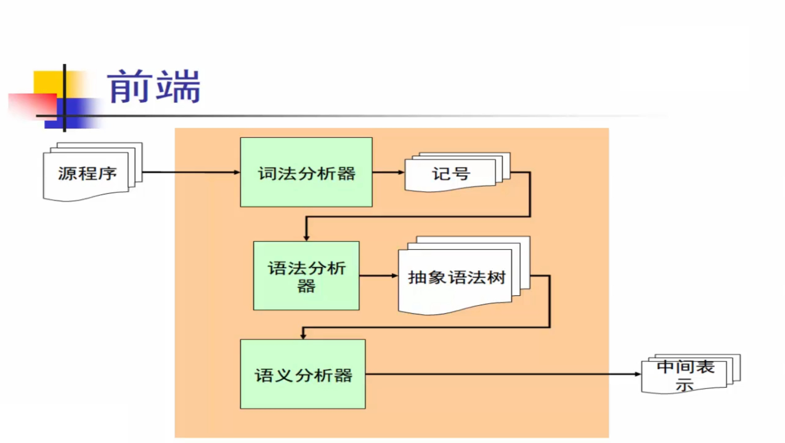

# 词法分析

## 词法分析的任务

### 定义

从字符流到记号流。

* 字符流：和被编译的语言密切相关（ASCII，Unicode，or ...）。
* 记号流：编译器内部定义的数据结构，编码所识别出的词法单元。

### 例子

### 实现方式

1. [手工编码实现](#manual)
   * 相对复杂、且容易出错。
   * 拥有完整控制权，因此灵活性高，可进行具体的性能优化，可以处理一些自动生成器难以处理的边缘情况和特殊需求。
   * 是目前非常流行的实现方法，例如：GCC, LLVM, ...
2. [词法分析器的生成器](#generator)
   * 可快速原型、代码量较少。
   * 细节较难控制，性能可能较低，依赖工具。
   * 常用的词法分析器生成器有：Lex, Flex, ANTLR, ...

## 正则表达式（RE）

### 定义

对给定的字符集 $\Sigma=\{c1，c2，…，cn\}$。
归纳定义:

* 空串 $\epsilon$ 是正则表达式。
* 对于任意 $c \in \Sigma$，$c$ 是正则表达式。
* 如果 $M$ 和 $N$ 是正则表达式，则以下也是正则表达式：
  * 选择	$M | N = \{M, N\}$
  * 连接	$MN = \{mn|m \in M, n \in N\}$
  * 闭包	$M^* = \{\epsilon, M, MM, MMM, ···\}$ （也叫 Kleen 闭包）

### 语法糖

* [c1-cn] == c1|c2|···|cn
* e+      == 一个或多个 e
* e?      == 零个或一个 e
* "a\*"    == a\* 自身，不是 a 的 Kleen 闭包
* e{i, j} == i 到 j 个 e
* .       == 除 '\n' 外的任意字符

## 有限状态自动机（FA）

### NFA

非确定性有限自动机（Nondeterministic Finite Automaton，NFA）。

NFA 是一种允许从一个状态对某个输入符号可以有多个转移（包括零个）的有限状态机。

对于 NFA，只要有一种路径能是接受状态，那这个字符串就能被接受。 

### DFA

确定性有限自动机（Deterministic Finite Automaton，DFA）。

DFA 是一种每个状态对每个输入符号都有且仅有一个转移的有限状态机

## 手工编码实现  

### 转移图

### 关键字表算法

* 对给定语言中所有的关键字，构造关键字构成的哈希表 H。
* 在词法分析过程中，词法分析器逐个扫描源代码中的字符，并通过关键字表算法来识别关键字。

通过合理的构造哈希表 H (完美哈希) 可以 O(1) 时间完成查询。

## 词法分析器的生成器  

### RE -> NFA: Thompson 算法

#### 算法介绍

Thompson 算法是一种将 RE 转换为 NFA 的方法。它通过构建简单的 NFA 片段，并根据正则表达式的操作（如连接、并集和闭包）递归的组合这些片段，逐步构建出整个正则表达式的 NFA。

这种方法生成的 NFA 具有较少的状态和转换，适合用于进一步的 DFA 转换。

时间复杂度 $O(n)$。

#### 算法思想

* 基于对 RE 的结构做归纳：
  * 对基本的 RE 直接构造。
  * 对复合的 RE 递归构造。(递归算法容易实现，不到 100 行的 C 代码)

#### 算法分析

下图前两个为基本的 RE，后三个为复合的 RE。

下面为它们对应的 RE -> NFA 的构造：

e -> $\mathcal{E}$

e -> c

e -> e1 e2

e -> e1 | e2

e -> e1$^*$

#### 例子

将 RE: (a|b)*a(a|b|ε)  转换为 NFA：

### NFA -> DFA: 子集构造算法

#### 算法介绍

子集构造算法是一种将 NFA 转换为 DFA 的方法。它通过将 NFA 的状态集合映射到 DFA 的单一状态，计算这些集合的 ε 闭包和输入符号的转换，从而构建出 DFA 的状态和转移表，使得 NFA 的所有可能路径都能在 DFA 中被唯一确定的路径表示，实现等价转换。

时间复杂度：最坏情况 $O(2^n \times n)$ ($n$ 是 NFA 的状态数)，但在实际中不常发生，因为并不是每个子集都会出现。

#### 算法分析

1. **初始状态**：
   * 计算 NFA 的 ε 闭包，即从 NFA 的初始状态出发，通过 ε（空）转换可以到达的所有状态的集合。这个集合作为 DFA 的初始状态。

2. **DFA状态集**：
   * 用一个集合来表示 DFA 的状态，每个 DFA 状态对应于包含多个 NFA 状态的一个集合。初始时，这个集合包含初始状态的 ε 闭包。

3. **状态转移**：
   * 迭代处理每个 DFA 状态（即 NFA 状态的集合），对于每个输入符号，计算从当前状态集合通过该输入符号到达的新状态集合。
   * 新状态集合是从当前状态集合中的**每个**状态出发，通过特定的**一个**输入符号转换到达的所有状态的 ε 闭包。如果这个状态集合是新的（即没有出现过的），将新的状态集合加入 DFA 状态集。（加入新点）
   * 在 DFA 中记录从当前状态集合通过特定输入符号到达的新状态集合的转移。（新图连边）
   * 继续处理下一个经过转移的  DFA 状态。

4. **接受状态**：
   - 如果 NFA 的某个状态是接受状态，并且它属于某个 DFA 状态集合，那么这个 DFA 状态集合也是接受状态。

#### 例子

把上个例子的 NFA 转为 DFA：

### DFA 的最小化：Hopcroft 算法

#### 算法介绍

Hopcroft 算法是一种用于最小化 DFA 的高效算法，是目前已知最优的算法。它通过反复细分状态集合，将状态划分为等价类，从而合并等价状态，生成状态数最少且等价于原 DFA 的最小化 DFA。

时间复杂度为 $O(n \log n)$，其中 $n$ 是 DFA 的状态数。

#### 算法步骤

1. **初始化划分**：将 DFA 的状态划分为两个组：一个包含所有终止状态，另一个包含所有非终止状态。

1. **迭代细分**：

   重复以下步骤直到不再发生细分：

   * 对于每个状态组和输入符号，检查其能够到达的状态。如果同一个状态组的这些点在某个输入符号下能够到达不同的状态组，则将这个状态组根据每个点到达的状态组分类，把状态组细分（能达到同一个状态组的点在同一个新的状态组，对于 u -> v 的边只会细分 u 所在集合）。

**复杂度分析**：在整个算法过程中，状态最多会被细分 $\log n$ 次，因为每次细分都会将集合的大小至少减少一半，每次细分完用 n 的时间重新扫描整个集合，总时间复杂度 $O(n \log n)$。

####  例子

##### 例子一

最小化的过程和结果：

##### 例子二

最小化的过程和结果：

