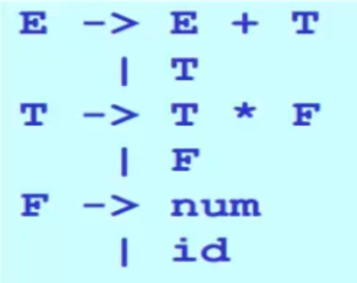
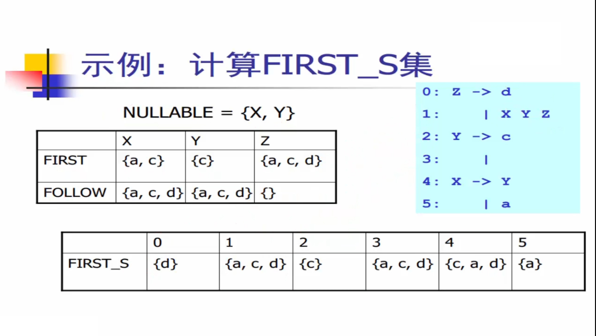

# 语法分析

## 语法分析任务

根据给定的语法规则，对输入的代码进行分析和解析，以确定代码是否符合语法规则，即：

给定[文法](#grammar) G 和[句子](#sentence) s，语法分析要回答的问题: 是否存在对句子 s 的推导？

## 语法分析的位置

## 上下文无关文法  

### 定义

上下文无关文法 G 是一个四元组:
$$
G = (T,N,P,S)
$$
其中：

* T 是终结符集合
* N 是非终结符集合
* P 是一组产生式规则
  * 每条规则的形式: $X \rightarrow \beta_1\ \beta_2\dots\beta_n$
    其中 $X\in N$，$\beta_i \in (T \cup N)$
* S 是唯一的开始符号 (非终结符)
  * $S \in N$

### 例子

#### 例子一

#### 例子二  

### 范式

课本所用的范式中，`|` 表示连续的 `->`；非终结符大写，终结符小写。

P.S. 另一种范式 bnf 中，非终结符用 `< >`  扩起来，终结符要加下划线。

### 推导

#### 定义

* 给定文法 G，从 G 的开始符号 S 开始，用产生式的右部替换左侧的**非终结符**。
* 此过程不断重复，直到不出现**非终结符**为止。
* 最终的串称为**句子**。 

#### 最左推导

每次总是选择**最左侧**的符号进行替换。

#### 最右推导

每次总是选择**最右侧**的符号进行替换。

### 二义性文法

#### 定义

* 给定文法 G，如果存在句子 s，它有两棵不同的分析树，那么称 G 是**二义性文法**。
* 从编译器角度，二义性文法存在问题：
  * 同一个程序会有不同的含义。
  * 因此程序运行的结果不是唯一的。 
* 解决方案: 文法的重写。

#### 文法的重写

例如上述的[例子二](#example2)的文法存在二义性:

可以重写产生式规则集合，消除二义性：

### 分析树

#### 定义

* **推导可以表达成树状结构**。
  * 和推导所用的顺序无关(最左、最右、其他)
* 特点:
  * 树中的每个**内部节点**代表**非终结符**。
  * 每个**叶子节点**代表**终结符**。
  * 每一步推导代表如何从双亲节点生成它的直接孩子节点。

## 自顶向下分析的算法思想

### 定义

* 语法分析: 给定文法 G 和句子 s，回答 s 是否能够从 G 推导出来?
* 基本算法思想: 从 G 的开始符号出发，随意推导出某个句子 t，比较 t 和 s：
  * 若 t == S，则回答 “是”。
  * 若 t != S，则回溯，如果所有情况都不成立，则回答 “否”。
* 因为这是从开始符号出发推出句子，因此称为**自顶向下分析**。
  * 对应于分析树自顶向下的构造顺序。

### 算法的讨论

* 算法需要用到回溯，给分析效率带来问题。
* 而就这部分而言(就所有部分)，编译器必须高效，因为编译器要编译上千万行的内核等程序。
* 因此，实际上我们们需要**线性时间**的算法：
  * 需要避免回湖。
  * 此处引出**递归下降分析算法**和 **LL(1) 分析算法**。

## 递归下降分析算法

### 定义

递归下降分析算法是一种自顶向下的语法分析技术，主要用于解析符合上下文无关文法的编程语言或表达式。该算法利用**一组递归函数**来表示文法的各个**产生式**，通过**逐步调用这些函数**来匹配输入串。每个函数对应一个非终结符，函数体内的逻辑按照文法规则进行匹配和递归调用，最终判断输入是否符合文法规范。递归下降分析易于实现和理解，但对处理左递归的文法不太友好，需要进行文法转换或其他处理。

* 也称为**预测分析**
  * 分析高效（线性时间）。
  * 容易实现（方便手工编码）。
  * 错误定位和诊断信息准确。
  * 被很多开源和商业的编译器所采用：GCC 4.0, LLVM，...
* 算法基本思想：
  * 每个非终结符构造一个分析函数。
  * 用前看符号指导产生式规则的选择。

## LL(1) 分析算法

### 定义

LL(1) 算法是一种自顶向下的语法分析算法，用于解析符合上下文无关文法的输入串。它通过分析输入串和候选产生式的首符号来预测产生式的选择，以达到语法分析的目的。

为了实现 LL(1) 分析，需要构建预测**分析表**，其中行表示非终结符，列表示终结符和输入串中的符号，表格中的每个单元格则存储了对应的产生式或错误信息。

* 从 **左 (L)** 向右读入程序，**最左 (L)** 推导，采用**一个 (1)** 前看符号
  * 分析高效（线性时间）。
  * 错误定位和诊断信息准确。
  * 有很多开源或商业的生成工具：ANTLR, ...
  * 但能分析的文法类型受限，往往需要文法的改写。
* 算法基本思想：表驱动的分析算法。

#### first 集

从非终结符开始推导得出的句子开头的所有可能终结符集合。

#### follow 集

表示在一个句型中某个非终结符号的后继位置上可能出现的终结符号集合。

### 表驱动的 LL 分析器架构

### 基本流程

**构建 LL(1) 预测分析表**：通过计算文法的 First 集合和 Follow 集合，填写 LL(1) 预测分析表。

**语法分析**：从文法的开始符号开始，根据 LL(1) 预测分析表和输入符号序列进行语法分析。LL(1) 解析器根据当前的非终结符号和输入符号来选择正确的产生式。

**错误处理**：在语法分析过程中，如果遇到无法匹配的情况，例如预测分析表中某个位置为空或者包含多个产生式，就会报告语法错误。

### 文法要求

LL(1) 的文法必须要**消除左递归**并且**提取公因子**。

即使进行了以上操作，所得文法也不一定满足 LL(1) 的文法要求，例如还存在间接的左递归等情况。

很直接的判断方式：直接构建出 LL(1) 的分析表，如果表中没有冲突，则该文法符合要求；如果发生了冲突，则文法不符合要求。

### 构造 LL(1) 分析表例子

1. 计算非终结符的 first 集和 follow 集。
2. 通过 1. 的表构建出 first_s 集，即每一行再计算一个 first 集，如果这个 first 集可以为空，则再加上对应非终结的 follow 集。
3. 通过 2. 的表构建出 LL(1) 分析表。

## 自底向上分析算法

### 定义

自底向上分析算法是一种语法分析技术，通过逐步将输入串的子串还原为文法的非终结符，直到还原出整个句子对应的开始符号，从而验证输入串是否符合文法。该算法从输入串的底部（即最小单位）开始构建解析树，使用归约和移入操作逐步归约为更高层的结构。常见的自底向上分析算法包括 LR（Left-to-right, Rightmost derivation）算法及其变种，如 SLR、LALR 和 CLR 等，广泛应用于编译器设计中，因其处理复杂文法的能力和高效性而受到青睐。

## LR 分析算法（移进-归约算法）（没理解啊）

### 定义

LR分析算法是一种自底向上的语法分析技术，通过**从左(L)**到右扫描输入串并构建其**最右(R)**推导的逆过程来验证输入是否符合上下文无关文法。该算法利用一个状态机和一个分析栈来实现，通过“移入”操作将输入符号移入栈中，通过“归约”操作将栈顶的符号序列替换为对应的非终结符。LR分析算法能够处理复杂和多样的文法，常见变种包括简单的 LR（SLR）、看前符号的 LALR（Look-Ahead LR）和更强大的 CLR（Canonical LR），广泛应用于编译器和语法分析器的实现中。

* 算法运行高效。
* 有现成的工具可用。
* 这也是目前应该广泛的一类语法分析器的自动生成器中采用的算法，如：YACC，bison，CUP，C#yacc, ...。

### 算法思想

### 点记号

为了方便标记语法分析器已经读入了多少输入，我们可以引入一个点记号 `·` 。

### 表驱动的 LR 分析器架构

### 算法分析

生成一个逆序的最右推导需要两个步骤：

* **移进**一个记号到栈顶上  

或者

* **归约**栈顶上的 n 个符号（某产生式的右部）到左部部的非终结符
  对产生式 $A \rightarrow \beta_1 \dots \beta_n$
  * 如果 $\beta_n\dots\beta1$ 在栈顶上，则弹出 $\beta_n\dots\beta1$
  * 压入A

核心的问题：如何确定移进和归约的时机？通过分析表确定：

### 算法缺点

1. 对每一个形如 X -> $\alpha\ ·$ 的项目，直接把 $\alpha$ 归约成 X，紧跟一个 "goto"，尽管不会漏掉错误，但会延迟错误发现时机。
2. LR(0)分析表中可能包含冲突。
