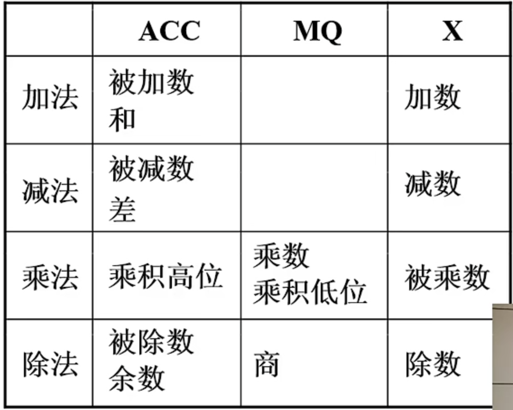

# 计算机系统概述

## 完成一条指令分为三个阶段：

1. 取指令

2. 分析指令

3. 执行指令

### 1. 取指令

   

### 2. 分析指令

### 3. 执行指令

（IR 中包含操作码和地址码，操作码传给 CU 进行分析，地址码传给 MAR）。

## 运算器加减乘除

一个格子中，上方为初始值，下方为结果值。

## 决定计算机速度的因素

IPS(Instructions Per Second) = $\frac{1}{CPI \times CPU\ 时钟周期}$

CPU 时钟频率（主频）= $\frac{1}{CPU\ 时钟周期}$

数据通路带宽：数据总线一次所能并行传送信息的位数。

吞吐量：指系统在单位时间内处理请求的时间。它取决于信息能多快地输入内存，CPU 能多快地取指令，数据能多快地从内存取出或存入，以及所得结果能多快地从内存送给一台外部设备。这些步骤中的每一步都关系
到主存，因此，系统吞吐量主要取决于主存的存取周期。

响应时间：指从用户向计算机发送一个请求，到系统对该请求做出响应并获得它所需要的结果的等待时间。通常包括 CPU 时间(运行一个程序所花费的时间) 与等待时间(用于磁盘访问、存储器访问、I/O操作、操作系统开销等时间)。

