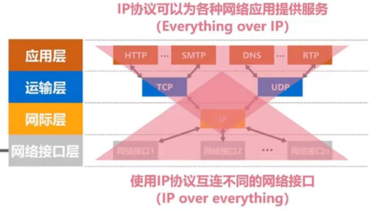

# 第一章 概述

## 因特网概述

### 网络、互连网（互联网）和因特网

* 网络（Network）由若干**结点**（Node）和连接这些结点的**链路**（Link）组成。

* 多个网络还可以通过路由器互连起来，这样就构成了一个覆盖范围更大的网络，即互联网（或互连网）因此，互联网是“**网络的网络**（Network of Networks）”

* 因特网（Internet）是世界上最大的互连网络（用户数以亿计，互连的网络数以百万计）。

  

### internet 与 lnternet 的区列

* internet（互联网或互连网）是一个通用名词，它**泛指**由多个计算机网络互连而成的网络。在这些网络之间的通信协议可以是任意的。
* Internet（因特网）则是一个专用名词，它**特指**当前全球最大的、开放的、由众多网络相互连接而成的特定计算机网络，它采用 TCP/IP 协议族作为通信的规则，其前身是美国的 ARPANET。


### *ISP 概述*

ISP（因特网服务提供商，Internet Service Provider）是一种为个人、家庭和企业提供访问互联网服务的公司或组织。用户通过支付订阅费用来使用这些服务， ISP 则负责维护网络基础设施，确保稳定的互联网连接。


### *基于 ISP 的三层结构的因特网*


这三层结构通过层级间的合作，确保了互联网的广泛覆盖和高效传输。

顺带一提，一旦某个用户能够接入到因特网，那么他也可以成为一个 ISP，所需要做的就是购买一些如调制解调器或路由器这样的设备，让其它用户能够和他相连。因此，该图所示的仅仅是个示意图，一个ISP可以很方便地在因特网拓扑上增添新的层次和分支。


### 因特网的组成

* 边缘部分：由所有连接在因特网上的**主机**组成。这部分是**用户直接使用**的，用来进行**通信**(传送数据、音频或视频)和**资源共享**。
* 核心部分：由**大量网络**和连接这些网络的**路由器**组成。这部分是**为边缘部分提供服务的**(提供连通性和交换)。


## 三种交换方式

三种主要的交换方式是**电路交换**、**报文交换**和**分组交换**。


### 电路交换

**电路交换**在通信开始前建立一条专用通道，适用于**电话**等连续传输数据的应用，但资源利用率低。因此，计算机网络通常采用分组交换，而不是电路交换。


### 分组交换

**分组交换**将数据拆分为多个小的分组，通过网络独立传输，然后在目的地重新组装，效率高且资源利用率好，是现代互联网**最常用**的交换方式。

各分组从源站到达目的站可以走不同的路径(也就是不同的路由)，分组到达目的站的顺序不一定与分组在源站的发送顺序相回。


### 报文交换

**报文交换**则将整段信息作为一个整体存储并转发（相比分组交换就是不分组）。报文交换主要用于**早期的电报通信网**，现在较少使用，通常被较先进的分组交换方式所取代。


## 计算机网络的定义

* 计算机网络的精确定义并未统一。
* 计算机网络的最简单的定义是：一些**互**相**连**接的、**自治**的计算机的**集合**。
  * 互连：是指计算机之间可以通过有线或无线的方式进行数据通信；
  * 自治：是指独立的计算机，它有自己的硬件和软件，可以单独运行使用；
  * 集合：是指至少需要两台计算机。
* 计算机网络的较好的定义是：计算机网络主要是由一些**通用的、可编程的硬件互连**而成的，而这些硬件并非专门用来实现某一特定目的（例如，传送数据或视频信号）。这些可编程的硬件能够用来**传送多种不同类型的数据**，并能**支持广泛的和日益增长的应用**。
  * 计算机网络所连接的硬件，并不限于一般的计算机，而是包括了智能手机等智能硬件。
  * 计算机网络并非专门用来传送数据，而是能够支持很多种的应用（包括今后可能出现的各种应用）。


## 计算机网络的分类

**按交换技术分类**

* 电路交换网络
* 报文交换网络
* 分组交换网络

**按使用者分类**

* 公用网
* 专用网

**按传输介质分类**

* 有线网络
* 无线网络

**按覆盖范围分类**

* 广域网 WAN
* 城域网 MAN
* 局域网 LAN
* 个域网 PAN（例如使用蓝牙技术连接手机、笔记本电脑的网络，电脑通过蓝牙连接耳机、鼠标和键盘勉强也算）

**按拓扑结构分类**

* 总线型网络
* 星型网络
* 环型网络
* 网状型网络


## 计算机网络的性能指标

### 速率

**比特**：计算机中**数据量的单位**，也是信息论中信息量的单位。。一个比特就是二进制数字中的一个 1 或 0 。

常用数据量单位：
8 bit = 1 Byte
KB = $2^{10}$ B
MB = $2^{20}$ B
GB = $2^{30}$ B
TB = $2^{40}$ B


**速率**：连接在计算机网络上的主机在数字信道上传送比特的速率，也称为**比特率**或**数据率**。

常用数据量单位：
bit/s (b/s, bps)
kb/s = $10^3$ b/s (bps)
Mb/s = $10^6$ b/s (bps)
Gb/s = $10^9$ b/s (bps)
Tb/s = $10^{12}$ b/s (bps)


**为什么比特和速率进制单位不一样**：

* 在计算机科学的早期，内存和存储设备的大小使用的是二进制，因此常用 1 KB = $2^{10}$ B 的定义。
* 随着互联网和数据传输的发展，尤其是在国际标准化组织（ISO）等组织的影响下，许多数据传输的单位（如 Kbps）开始采用十进制来更容易地进行跨设备、跨系统的数据计算和交流，因此 1 Kbps = $10^3$ bps。


**例题**：

有一个待发送的数据块，大小为 100 MB，网卡的发送速率为 100 Mbps，则网卡发送完该数据块需要多长时间？
$$
\begin{alignat}{3}
\frac{100 MB}{100 Mb/s} 
&= \frac{MB}{Mb/s} \notag \\  % 手动换行
&= \frac{2^{20}\times8b}{10^6 b/s} \notag \\
&=8.388608\ s \\ \\
（估算）\frac{MB}{Mb/s} \notag &\approx\frac{B}{b/s} \\
&= \frac{8b}{b/s} \\
&=8\ s 
\end{alignat}
$$


### 带宽

**带宽在模拟信号系统中的意义**

* **信号**所包含的各种不同频率成分所占据的**频率范围**。
* 单位：Hz（kHz，MHz，GHz）
* 例如电话的带宽是 3.1 kHz(0.3 kHz ~ 3.4 kHz)，涵盖了人声的主要频率成分。

**带宽在计算机网络中的意义**

* 用来表示网络的**通信线路**（例如网线）所能传送数据的能力，因此网络带宽表示在**单位时间内**从网络中的某一点到另一点所能通过的“**最高数据率**”;
* 单位:b/s（kb/s, Mb/s, Gb/s, Tb/s）

其实，“带宽”的这两种表述之间有着密切的联系。一条通信线路的“频带宽度”越宽，其所传输数据的“最高数据率”也越高。


### 吞吐量

吞吐量表示在**单位时间内通过某个网络（或信道、接口）的数据量**。

吞吐量被经常用于对现实世界中的网络的一种测量，以便知道实际上到底有多少数据量能够通过网络。

吞吐量**受网络的带宽或额定速率的限制**。


### 速率、带宽、吞吐量的区别:

带宽是理论最大速度，吞吐量是在受延迟、丢包等因素影响下的实际速度。

速率像是一种描述速度的概念，带宽是传输数据的速率（单位 bps），不同于电磁波传播速率（单位 m/s）（表示电磁波在媒介中传播的速度）。

**带宽和电磁波传播速率的区别**：

* **带宽**：把传输比特的时间看成一段线段，带宽越大，单位比特传输所需时间越短，线段越短。
* **电磁波传播速率**：线段们以光速在信道上前进。


### 时延

**时延**是指数据在网络中从发送方到接收方所需的时间，它通常包括发送时延、传播时延、处理时延（包括了排队时延在里面）。

* 发送时延 = $\frac{分组长度(b)}{发送速率(b/s)}$
* 传播时延 = $\frac{信道长度(m)}{电磁波传播速率(m/s)}$
* 处理时延一般不方便计算，因为网络中的数据流量是动态变化的，因此路由器的繁忙程度也是动态变化的，加上各种路由器的软硬件性能也可能有所不同，因此很难用一个公式计算出处理时延。

注意：

* 大部分情况下，传播时延远小于发送时延，因为它的耗时和分组长度无关，发送比特时它们是立刻在线路上传播的，所以总时延只计算最后一个比特到达所需要的时间。

* 发送时延中的比特是一个线段而非一个点，表示这段时间持续发送一个比特数据。即使只传输 1 比特的数据，发送时延也可以比传播时延长，这代表另一端已经接收到这比特是 1 了，但发送端仍然在持续发送，说明着这比特的数据是 1 。
* 


电磁波传播速率：

* 自由空间：$3\times10^8\ m/s$
* 铜线：$2.3\times10^8\ m/s$
* 光纤：$2\times10^8\ m/s$


### 时延带宽积


**时延带宽积**是**传播时延**和**带宽**的乘积，衡量的是“数据管道”中同时能够存在的比特数。

若发送端连续发送数据，则在所发送的第一个比特即将到达终点时，发送端就已经发送了时延带宽积个比特。

链路的时延带宽积又称为**以比特为单位的链路长度**。（**时延 × 带宽** 得出的值是链路上在传播延迟期间可以容纳的比特数个，这个积的单位是比特，所以它被称为“以比特为单位的链路长度”。）


### 往返时间

在许多情况下，因特网上的信息不仅仅单方向传输，而是双向交互；

我们有时很需要知道双向交互一次所需的时间；

因此，往返时间 RTT(Round-Trip Time) 也是一个重要的性能指标。

（注：有些题目把发送时延包含在 RTT，有些不包含，神奇）


### 利用率

利用率分为：

* **信道利用率**：用来表示某信道有百分之几的时间是被利用的(有数据通过)
* **网络利用率**：全网络的信道利用率的加权平均。

根据排队论，当某信道的利用率增大时，该信道引起的时延也会迅速增加。因此，信道利用率并非越高越好。

如果令 $D_o$ 表示网络空闲时的时延，$D$ 表示网络当前的时延，那么在适当的假定条件下，可以用下面的简单公式来表示 $D$、$D_o$ 和利用率 $U$ 之间的关系:
$$
D = \frac{D_0}{1 - U}
$$


* 当网络的利用率达到 50% 时，时延就要加倍；
* 当网络的利用率超过 50% 时，时延急剧增大；
* 当网络的利用率接近 100% 时，时延就趋于无穷大；
* 因此，一些拥有较大主干网的 ISP 通常会控制它们的信道利用率不超过 50% ，超出了就要准备扩容，增大线路的带宽。

信道利用率也不能过低，以免浪费宝贵的通信资源。应采用机制动态调整输入到网络中的通信量，保持合理的网络利用率。


### 丢包率

**丢包率**即分组丢失率，是指在一定的时间范围内，传输过程中**丢失的分组数量与总分组数量的比率**。

丢包率具体可分为接口丢包率、结点丢包率、链路丢包率、路径丢包率、网络丢包率等。

丢包率是网络运维人员非常关心的一个网络性能指标，但对于普通用户来说往往并不关心这个指标因为他们通常意识不到网络丢包。

分组丢失主要有两种情况：

* 分组在传输过程中出现**误码**，被结点丢弃。
* 分组到达一台队列已满的分组交换机时被丢弃；在通信量较大时就可能造成**网络拥塞**。

因此，丢包率反映了网络的拥塞情况:

* 无拥塞时路径丢包率为 0
* 轻度拥塞时路径丢包率为 1% ~ 4%
* 严重拥塞时路径丢包率为 5% ~ 15%


## 计算机网络体系结构

### 常见的结构


OSI 模型是 ISO（国际标准化组织）于 1984 年发布的网络通信标准，具有法律上的国际认可。

TCP/IP 协议是当前互联网最基础的协议，全球几乎所有的网络通信设备都基于 TCP/IP 协议。这使 TCP/IP 体系结构成为事实上的标准。


**TCP/IP 体系结构：**


IP 协议可以将不同的网络接口进行互连，并向其上的 TCP 协议和 UDP 协议提供网络互连服务。

TCP 协议在享受 IP 协议提供的网络互连服务的基础上，可向应用层的相关协议提供**可靠传输**的服务；
UDP 协议在享受 IP 协议提供的网络互连服务的基础上，可向应用层的相关协议提供**不可靠传输**的服务。




### 结构分层的必要性

* **计算机网络是个非常复杂的系统**。早在最初的 ARPANET 设计时就提出了分层的设计理念
* “**分层**”可将庞大而复杂的问题，转化为若干较小的局部问题，而这些较小的局部问题就比较易于研究和处理。
* 下面，我们按照由简单到复杂的顺序，来看看实现计算机网络要面临哪些主要的问题，以及如何将这些问题划分到相应的层次，层层处理。


首先，我们需要想办法将两台计算机**相连**，传输比特数据：


解决完物理层的问题后，两台计算机之间就可以传输比特数据了，但在**局域网**内多台主机同时传输数据出现了许多新问题：


解决完数据链路层的问题后，同一个局域网的计算机就可以相互传输比特数据了，但如果要让**多个网络互连**就会有新问题：


解决完网络层的问题后，计算机可以通过互联网跨越全球进行数据传输了。但对于计算机网络的应用而言，这仍然不够，我们还需解决**端到端**的**传输质量**（发生传输错误怎么办）和**数据管理**（数据是传给哪个应用的）的问题。


解决了运输层的问题后，我们实现了端到端的可靠传输，即应用程序之间可以通过网络发送和接收数据，且这些数据能够按需、可靠、无错地传输到目标设备。接下来，我们需要解决的是应用程序之间的**语义、格式、协议约定**等问题，确保两端的应用程序能够**理解和正确处理传输的数据**。


解决完应用层的问题后，我们最终实现了**完整的网络通信和应用功能**，用户可以通过网络访问各种服务和应用程序，并在不同的设备和平台之间无缝交互。


### 结构分层思想举例

<video src="../../assets/计算机网络/vedio/1_1.mp4"></video>


### 结构中的专用术语

专用术语包含实体、协议、服务。


#### 实体

**实体**：任何可发送或接收信息的**硬件**或**软件进程**。

**对等实体**：收发双方**相同层次中的实体**。


#### 协议

**协议**：控制两个对等实体进行逻辑通信的规则的集合。


需要注意的是，之所以被称为逻辑通信，是因为这种通信其实并不存在。它只是我们假设出来的一种通信。目的在于方便我们单独研究体系结构某一层时，不用考虑其它层


**协议的三要素**：语法、语义、同步。

**语法**：定义所交换信息的格式（划分了前几段的比特是干什么的，中间几段是干什么的，后面几段是干什么的）。


**语义**：定义收发双方所要完成的操作（每段的 01 数据代表了什么含义）。


**举例：**
如果一个HTTP报文中写了：

```http
GET /index.html HTTP/1.1
```

- 语法规定 `GET`、`/index.html` 和 `HTTP/1.1` 要按顺序写，并用空格分隔。
- 语义规定 `GET` 是请求资源，`/index.html` 是资源路径，`HTTP/1.1` 是使用的协议版本。


**同步**：定义收发双方的时序关系。


#### 服务

**服务**：协议的控制下，两个对等实体间的逻辑通信使得本层能够向上一层提供服务。

要实现本层协议，还需要使用下面一层所提供的服务。

协议是**“水平的”**，服务是**“垂直的”**。

实体看得见相邻下层所提供的服务，但并不知道实现该服务的具体协议。也就是说，下面的协议对上面的实体是**透明**（或者说不可见）的。本来我们也不需要看见，也就是封装的思想，这就好比，我们肯定看得见手机为我们提供的各种服务，但我们只需要享受这些服务，而没有必要弄懂手机的工作原理。


**服务访问点**：同一系统中**相邻两层的实体交换信息的逻辑接口**，用于区分不同的服务类型。

* 数据链路层的服务访问点为帧的“类型”字段。
* 网络层的服务访问点为IP数据报首部中的“协议字段”。
* 运输层的服务访问点为“端口号”。

**服务原语**：上层使用下层所提供的服务必须通过与下层**交换一些命令**，这些命令称为服务原语。


**协议数据单元 PDU**：**对等层次之间传送的数据包**称为该层的协议数据单元。

**服务数据单元 SDU**：**同一系统内，层与层之间交换的数据包**称为服务数据单元。

多个 SDU 可以合成为一个 PDU ；一个 SDU 也可划分为几个 PDU 。


