# 第三章 数据链路层

## 概述

**链路**（Link）就是从一个结点到相邻结点的一段物理线路，而中间没有任何其他的交换结点。
**数据链路**（Data Link）是指把实现通信协议的硬件和软件加到链路上，就构成了数据链路。
数据链路层以**帧**为单位传输和处理数据。

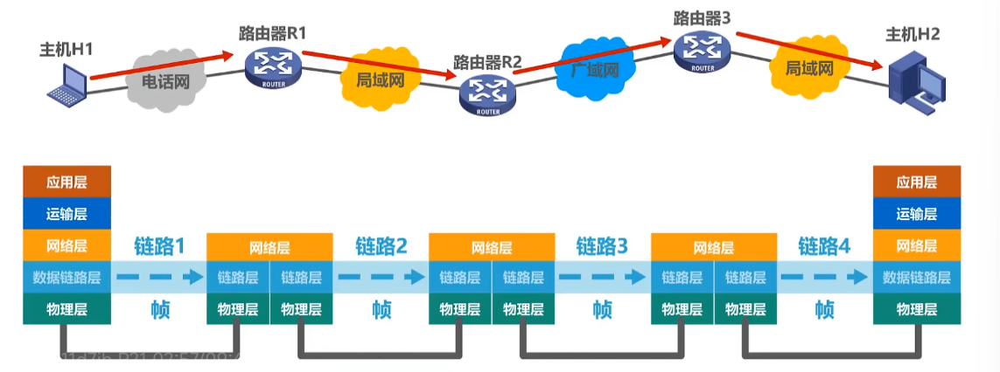

### 使用点对点信道的数据链路层

点对点信道的数据链路层通信需要解决**三个重要问题**：

* 封装成帧：将数据按一定格式组织成帧，以便在网络中进行传输，每帧包含控制信息和数据部分。

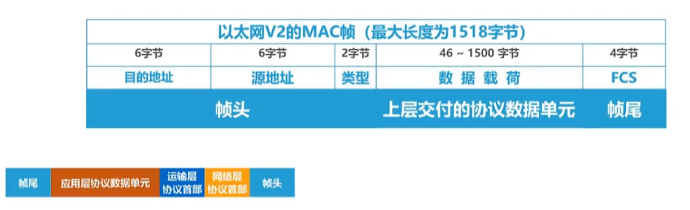

* 差错检测：通过附加冗余信息来检测传输过程中可能发生的错误，从而保证数据的完整性。

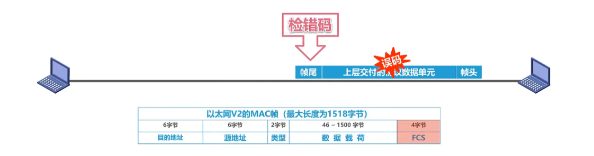

* 可靠传输：尽管误码是不能完全避免的，但若能实现发送方发送什么接收方就能收到什么，就称为可靠传输。具体则是通过确认应答、重传机制等手段确保数据在不可靠的网络环境中能够正确、完整地传送，会在下文介绍。

### 使用广播信道的数据链路层

上述三个重要问题针对点对点信道的数据链路层通信，那如果不是点对点而是使用广播信道的数据链路层，如何知道所收到的帧是不是发送给它们的？

答案是通过帧头中的信息判断。

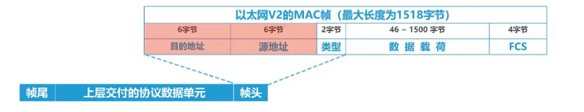

那链路上的碰撞如何避免呢？

答案是通过`共享式以太网的媒体接入控制协议 CSMA/CD 协议`，`802.11 局域网的媒体接入控制协议 CSMA/CA` 等协议控制，会在之后介绍。

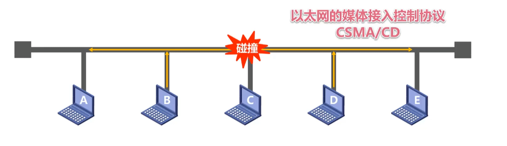

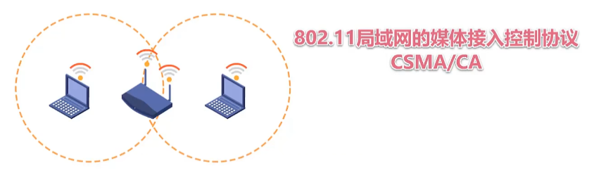

### 数据链路层的互连设备

随着技术的发展，交换技术的成熟和成本的降低，具有更高性能的使用点对点链路和链路层交换机的交换式局域网在有线（局域网）领域已完全取代了共享式局域网。不过，由于无线信道的广播天性，无线局域网仍然使用的是共享信道技术。

对于这些互连设备，像是网桥和交换机的工作原理，集线器（物理层互连设备）与交换机的区别等内容会在下文逐个进行介绍。

## 封装成帧

**封装成帧**是指数据链路层给上层交付的协议数据单元添加帧头和帧尾使之成为帧。帧头和帧尾中包含有重要的控制信息。

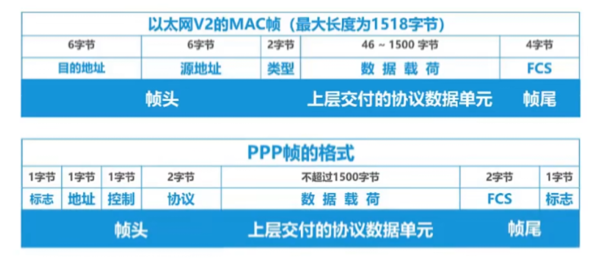

### 帧定界

那接收方的数据链路层如何从物理层交付的比特流中提取出一个个的帧？

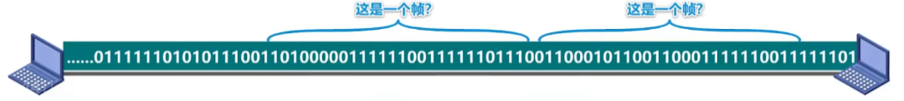

可以通过帧头和帧尾。

帧头和帧尾的作用之一就是**帧定界**。

通过在头和尾加入一个标志字符，让接收端以此来判断一个帧什么时候开始和结束。

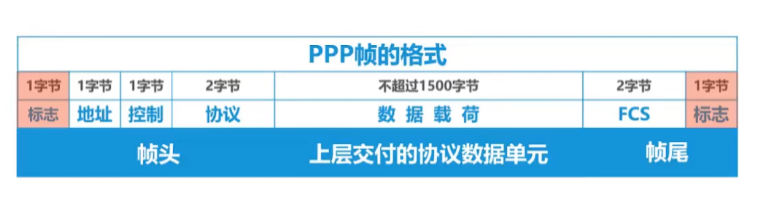

但似乎这样会导致中间的数据中不能出现这个标志字符了，这样就不能满足透明传输的要求。

### 透明传输

**透明传输**是指**数据链路层对上层交付的传输数据没有任何限制**，就好像数据链路层不存在一样，自然不会对其中出现的内容加以限制。

那如何解决此问题？答案是使用转移字符，和 C++ 字符串中的转移字符一样，把数据中的标志字符和转义字符全部转义掉，这样它们就不会被误判了。

如 C++ 中的字符串 `he said "Oh Mary\contrary\\how does your garden grow?".` 需要加入转义字符变成 `"he said \"Oh Mary\\contrary\\\\how does your garden grow?\"."`

在这里，一段数据：

需要加入转移字符变成：

需要说明的是，转义字待是一种特殊的控制字符，其长度为1个字节，ascii 码为27，而并不是 E、S、C 这 3 个字符🤣。

在**面向字节**的物理链路使用**字节填充**（或称字符填充）的方法实现透明传输。

而在**面向比特**的物理链路中使用**比特填充**的方法实现透明传输。

帧的首部和尾部都是 `01111110`（六个 1），因此发送端对数据部分，每连续五个 1 后面就插入一个 0，这样首位标志就是唯一的了。接收段再每连续五个 1 后面去掉一个 0，这样数据就还原了。

例子：

* 数据：**01111110**0111110100011111111**01111110** 
* 发送端加 0 ：**01111110**011111**0**0100011111**0**111**01111110** 
* 接收段去 0 ：**01111110**011111~~0~~0100011111~~0~~111**01111110** 

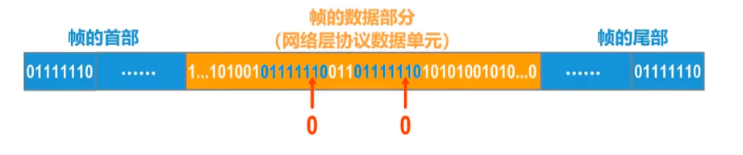

此外，需要说明的是，并不是每一种数据链路层协议的帧都包含有帧定界标志。例如以太网 V2 的 MAC 帧中就不存在用于定界的部分，因为它把定界的任务丢给了物理层的前导码。

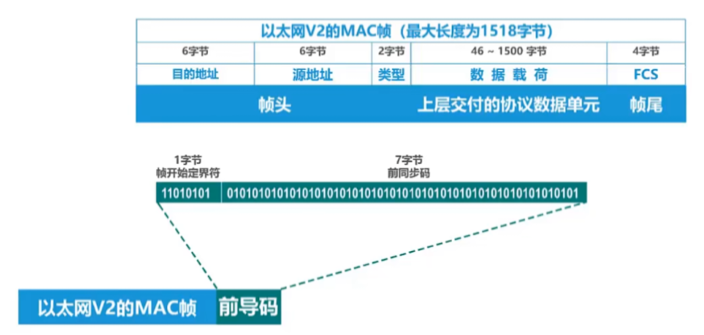

另外，以太网还规定了帧间间隔时间为 96 比特的发送时间，因此，MAC 帧并不需要帧结束定界符。

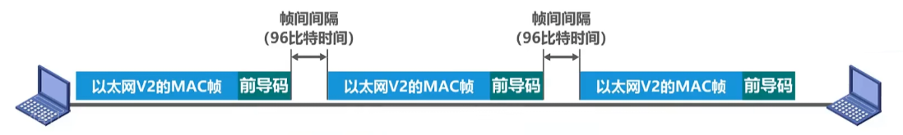

### 长度要求

* 为了提高帧的传输效率，应当使**帧的数据部分的长度尽可能大些**。
* 但同时，考虑到差错控制等多种因素，每一种数据链路层协议都规定了帧的数据部分的长度上限，即最大传送单元 MTU (Maximum Transfer Unit)。

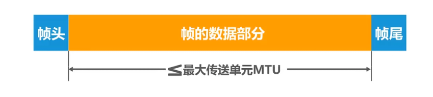

## 差错检测

* 实际的通信链路都不是理想的，比特在传输过程中可能会产生差错：1 可能会变成 0 而 0 也可能变成 1。这称为**比特差错**。
* 在一段时间内，传输错误的比特占所传输比特总数的比率称为**误码率 BER** (BitError Rate)。
* 使用**差错检测码**来检测数据在传输过程中是否产生了比特差错，是数据链路层所要解决的重要问题之一。
* **检错码**只能检测出帧在传输过程中出现了差错，但并不能定位错误，因此**无法纠正错误**。
* 要想纠正传输中的差错，可以使用冗余信息更多的**纠错码**进行**前向纠错**。但纠错码的开销比较大，**在计算机网络中较少使用**。
* 循环冗余校验 **CRC** 有很好的检错能力（**漏检率非常低**），虽然计算比较复杂，但非常**易于用硬件实现**，因此被**广泛应用于数据链路层**。
* 在计算机网络中通常采用我们后续课程中将要讨论的**检错重传方式来纠正传输中的差错或者仅仅是丢弃检测到差错的帧**，这取决于数据链路层向其上层提供的是可靠传输服务还是不可靠传输服务。

奇偶校验和 CRC 详见机组[校验码](../计算机组成原理/数据的表示和运算.html#校验码)。

## 可靠传输

使用**差错检测技术**（例如循环冗余校验 CRC），接收方的数据链路层就可检测出帧在
传输过程中是否产生了**误码**（比特错误）。

数据链路层向上层提供的服务类型：

* **不可靠传输服务**：**仅仅丢弃有误码的帧**，其他什么也不做;
* **可靠传输服务**：想办法实现**发送端发送什么**，**接收端就收到什么**。

一般情况下，**有线链路**的误码率比较低，为了减小开销，**并不要求数据链路层**向上提供
**可靠**传输服务。即使出现了误码，可靠传输的问题由其上层处理。

**无线链路**易受干扰，误码率比较高，因此**要求数据链路层**必须向上层提供**可靠**传输服务。

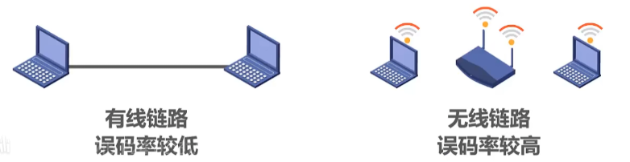

**比特差错**只是传输差错中的一种。

从整个计算机网络体系结构来看，传输差错还包括**分组丢失**、**分组失序**以及**分组重复**。

分组丢失、分组失序以及分组重复这些传输差错，一般不会出现在数据链路层，而会
出现在其上层。因此，**可靠传输服务并不仅局限于数据链路层**，其他各层均可选择实现可靠传输。

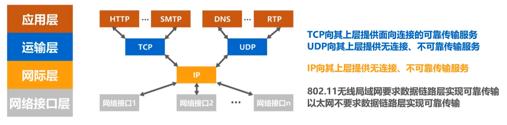

可靠传输的实现比较复杂，开销也比较大，是否使用可靠传输取决于应用需求。

可靠传输的**实现机制**有下列三种：

* 停止-等待协议 SW
* 回退 N 帧协议 GBN
* 选择重传协议 SR

这三种可靠传输实现机制的基本原理并不仅限于数据链路层可以应用到计算机网络体系结构的各层协议中。希望大家在学习时，不要把思维局限在数据链路层，而应放眼于整个网络体系结构。

### 停止-等待协议 SW

Stop-and-Wait Protocol.

停止等待协议通常用于较为简单的应用场景，适合数据量较小且网络延迟相对较低的情况。在大多数高效的通信协议中，停止等待协议的概念会被扩展成更复杂的流控机制。

#### 协议流程

1. **发送方**：发送方将数据包发送给接收方，然后等待接收方发送确认（ACK）。
2. **接收方**：接收方在接收到数据包后，会检查数据包是否正确，如果正确，发送一个**确认消息（ACK）**回发送方，否则发送**否定确认消息（NAK）**。
3. **超时重传**：如果发送方接收到了 NAK，或者在指定时间内没有收到 ACK，它会重传相同的数据包。

**主要特点**：

发送方每次只发送**一个**数据包，并等待接收方确认收到这个数据包后才会发送下一个数据包。因此，发送方每发送完一个数据包后，并不能立刻将该数据包从缓存中删除，只有在收到针对该数据包的确认包后，才能将其从缓存中删除。

#### 差错情况与解决

**发送消息出现误码**

接收方检测到数据分组有误码时，将其丢弃并等待发送方的超时重传。但对于误码率较高的点对点链路，为使发送方**尽早重传**，也可**给发送方发送 NAK 分组**。

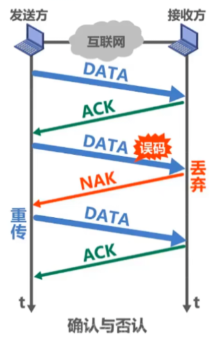

**发送消息丢失**

接收方收不到数据分组，就不会发送 ACK 或 NAK。如果不采取其他措施，发送方就会一直处于等待接收方 ACK 或 NAK 的状态。

为解决该问题，可以在发送方发送完一个数据分组时，启动一个超时计时器。若到了超时计时器所设置的重传时间而发送方仍收不到接收方的任何 ACK 或 NAK，则重传原来的数据分组，这就叫做**超时重传**。

超时计时器设置的**重传时间**应仔细选择。一般可将重传时间选为**略大于“从发送方到接收方的平均往返时间”**。

* 在数据链路层点对点的往返时间比较确定，重传时间比较好设定。

* 然而在运输层，由于端到端往返时间非常不确定，设置合适的重传时间有时并不容易。

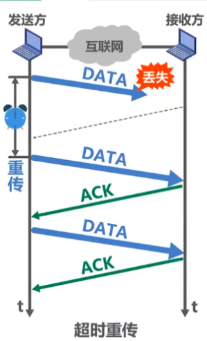

**ACK 丢失**

发送方会超时重传，但接收方该怎么知道这是个重复分组还是个新分组呢？

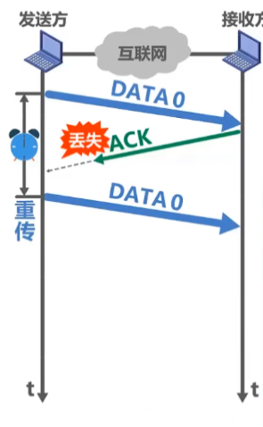

为了让接收方能够判断所收到的数据分组是否是重复的，需要给**数据分组编号**。

对于停止-等待协议，由于每发送一个数据分组就停止等待，只要保证每发送一个新的数据分组，其发送序号与上次发送的数据分组的序号不同就可以了，因此用**一个比特**来编号就够了。

这样接收方就能知道目前接收到的是重复的分组，直接丢弃并且重新返回一个 ACK。

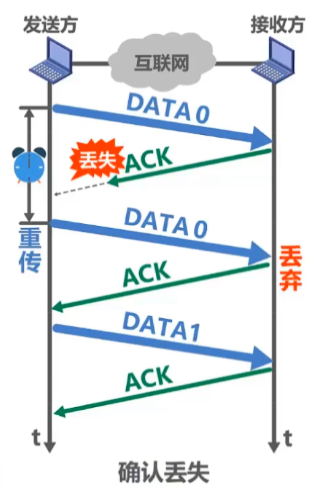

那么，确认分组需要编号吗？来看下面这个情况。

**ACK 迟到**

如图，接收方成功接收到了数据 `DATA 0`，也发送了 ACK，但由于种种原因 ACK 迟到了，此时的发送端已经发生了超时重传，有一份新的 `DATA 0` 已经在路上了，此时接收到 ACK 的发送端继续发送 `DATA 1`，那此时第二份 `DATA 0` 的 ACK 返回给发送端时，发送端就无法分辨这究竟是 `DATA 0` 的 ACK 还是 `DATA 1` 的 ACK。

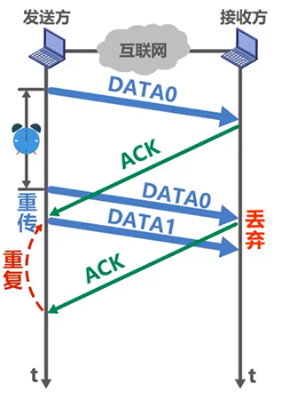

所以，为了让发送方能够判断所收到的 ACK 分组是否是重复的，需要给 **ACK 分组编号**，所用比特数量与数据分组编号所用比特数量一样。

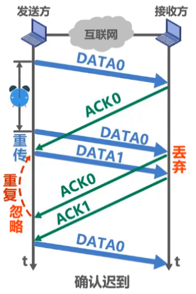

需要说明的是，对于数据链路层的点对点信道，重返时间比较固定，不会出现确认迟到的情况。因此，如果只在数据链路层实现停止-等待协议，可以不用给确认分组编号。

#### 信道利用率

$T_D$：发送分组的发送时延。

$RTT$：往返时间。注意此处的 $RTT$ 并不包括发送时延。

$T_A$：确认分组的发送时延（因为很短一般会忽略不计）。

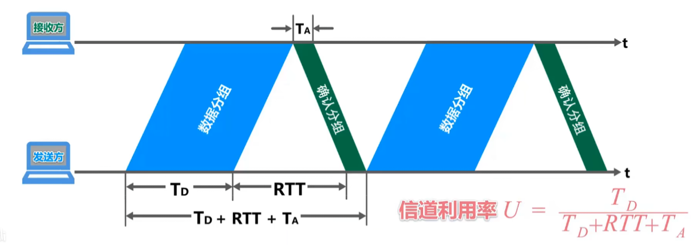

下面是计算信道利用率的一个例子。

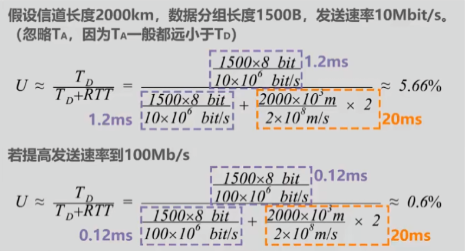

因此可见：

* 当往返时延 $RTT$ 远大于数据帧发送时延 $T_D$ 时(例如使用卫星链路)，信道利用率非常低。
* 若出现重传，则对于传送有用的数据信息来说，信道利用率还要降低。
* 为了克服停止-等待协议信道利用率很低的缺点，就产生了另外两种协议，即回退 N 帧协议 GBN 和选择重传协议 SR。

顺便提一下，停止等待协议这种通过确认和重传机制实现的可靠传输协议，常称为自动请求重传协议 ARQ（Automatic Repeat reQuest），意思是重传的请求是自动进行的。因为不需要接收方显式地请求发送方重传某个出错的分组。

### 回退 N 帧协议 GBN

停止-等待信道利用率太低，因此考虑连续发送一堆数据来提高利用率，这就是**回退 N 帧协议**（Go-Back-N ARQ，简称 GBN）的基本思想。

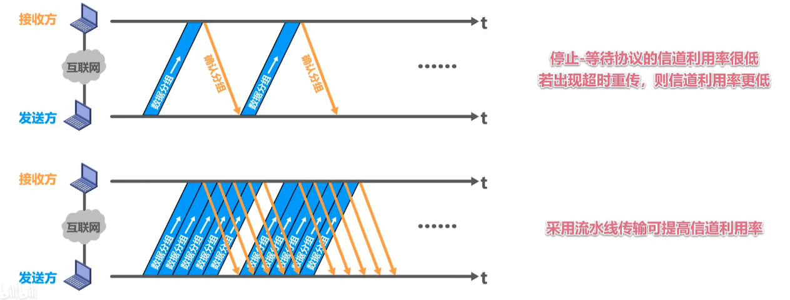

回退 N 帧协议有一个发送窗口和一个接收窗口，只有落在窗口内的分组允许被发送/接收。

发送窗口尺寸 $W_T$ 的取值范围是 $1 < W_T \leq 2^n - 1$ 。其中，n 是构成分组序号的比特数量。
$$
\begin{aligned}
  W_T = 1  &\quad \text{等价于停止-等待协议} \\
  W_T > 2^n - 1  &\quad \text{接收方无法分辨新、旧数据分组}
\end{aligned}
$$
接收方的接收窗口尺寸W的取值范围是 $W_R = 1$ 。因此接收方只能按序接收数据分组。

#### 协议流程

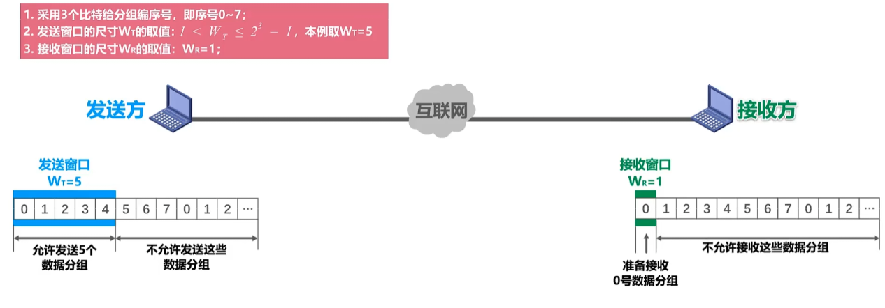

（无误码情况）

1. 发送方可在未收到接收方确认分组的情况下，将序号落在发送窗口内的多个数据分组全部发送出去。
2. 接收方只接收序号落在接收窗口内且无误码的数据分组，并且将接收窗口向前滑动一个位置，与此同时给发送方发回相应的确认分组。
3. 接收方收到未按序到达的数据分组，除丢弃外，还要对最近按序接收的数据分组进行确认，返回该分组的 ACK。
4. 发送方只有收到对已发送数据分组的确认时，发送窗口才能向前相应滑动。
5. 发送方发送窗口内**某个已发送的数据分组产生超时重发**时，**其后续**在发送窗口内且己发送的数据分组也**必须全部重传**，这就是**回退 N 帧**协议名称的由来。

对于第二步，为了减少开销，接收方不一定每收到一个按序到达且无误码的数据分组就给发送方发回一个确认分组。而是可以在连续收到好几个按序到达且无误码的数据分组后(由具体实现决定)，才针对最后一个数据分组发送确认分组，这称为**累积确认**。或者可以在自己有数据分组要发送时才对之前按序接收且无误码的数据分组进行捎带确认。

#### 差错情况与解决

**发送消息出现误码/丢失**

如图，发送分组 5,6,7,0,1 依次发送，但此时 CRC 检测出分组 5 出现误码，便直接丢弃，同时返回 ACK 4。后续到来的 6,7,0,1 因为和接收窗口要接收的序号对不上，因此也全部被丢弃，同时每个都返回一个 ACK 4 。等到发送方的分组 5 超时重发时，会把发送窗口内 5 和它往后的分组(即 5,6,7,0,1)一起全部重发。另外，当发送方收到多个重复确认时（说明后面的数据都被丢弃了，才连续返回同一个 ACK），可在重传计时器超时前尽早开始重传，由具体实现决定。

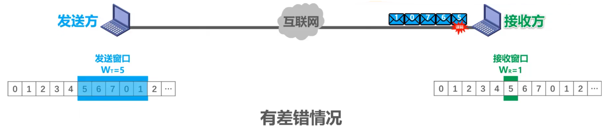

由上例可见，当通信线路质量不好时，回退 N 帧协议的信道利用率并不比停止-等待协议高。

**如果设置的 $W_T$ 超过范围取值**

例如上例取 $W_T$ = 8，会有什么问题？

来看实例：

此时发送方发送完了 0~7 的数据，接收方成功接收，但 ACK 分组丢失，发送方超时重传，重传的分组编号依旧是 0~7，但对接收方来说，要接收的新数据编号也是 0~7，接收方就无法分辨此时到来的是新分组还是重发的旧分组。因此 $W_R$ 必须 $\leq$ $2^n-1$，才能保证新旧分组中不会出现相同的序号。。

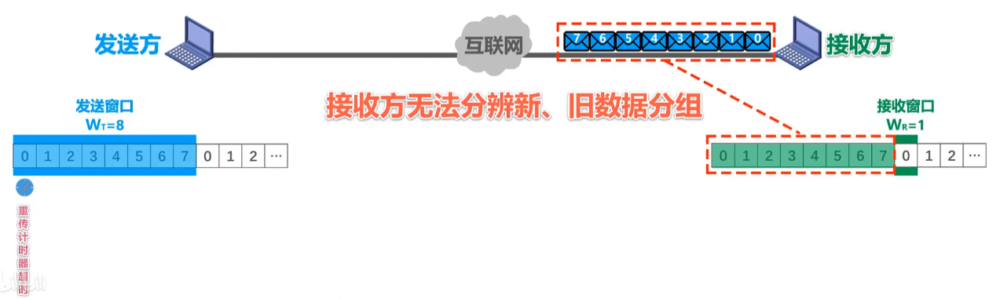

**顺带一提**

* 回退 N 帧协议在流水线传输的基础上利用发送窗回来限制发送疗连续发送数据分组的数量，是一种连续 ARQ 协议。
* 在协议的工作过程中发送窗回和接收窗回不断向前滑动，因此这类协议又称为滑动窗口协议。
* 由于回退 N 帧协议的特性，当通信线路质量不好时，其信道利用率并不比停止-等待协议高。

### 选择重传协议 SR

**回退 N 帧协议**的接收窗口尺寸 **$W_R$ 只能等于 1**，因此**接收方只能按序接收正确到达的数据分组**。

一个数据分组的误码就会导致其后续多个数据分组不能被接收方按序接收而丢弃(尽管它们无乱序和误码)。这必然会造成发送方对这些数据分组的超时重传，显然这是对通信资源的极大浪费。

为了进一步提高性能，可设法只重传出现误码的数据分组。因此，接收窗口的尺寸 **$W_R$ 不应再等于 1 (而应大于 1)**，以便**接收方先收下失序到达但无误码并且序号落在接收窗口内的那些数据分组**，等到所缺分组收齐后再一并送交上层。这就是**选择重传协议**。

**注意:**
**选择重传协议**为了使发送方仅重传出现差错的分组，接收方**不能再采用累积确认**，而需要对每个正确接收到的数据分组进行**逐一确认**！

与回退 N 帧协议相同，选择重传协议有一个发送窗口和一个接收窗口，只有落在窗口内的分组允许被发送/接收。

发送窗口尺寸 $W_T$ 的取值范围是 $1 < W_T \leq 2^{n-1}$ 。其中，n 是构成分组序号的比特数量。
$$
\begin{aligned}
  W_T = 1  &\quad \text{等价于停止-等待协议} \\
  W_T > 2^{n - 1}  &\quad \text{接收方无法分辨新、旧数据分组}
\end{aligned}
$$
接收窗口尺寸 $W_R$ 必须满足：$1 < W_R \leq W_T$
$$
\begin{aligned}
  W_R = 1  &\quad \text{等价于回退 N 帧协议} \\
  W_R > W_T  &\quad \text{无意义}
\end{aligned}
$$

#### 协议流程

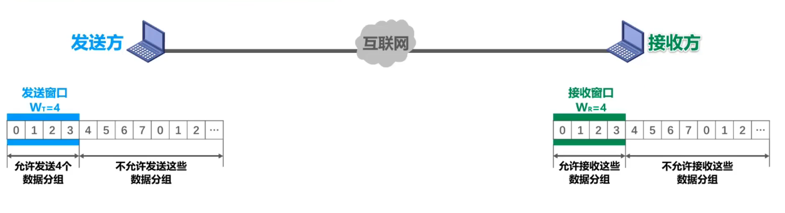

1. 发送方可在未收到接收方确认分组的情况下，将序号落在发送窗口内的多个数据分组全部发送出去。
2. 接收方可接收未按序到达但没有误码并且序号落在接收窗口内的数据分组，并对每个正确接收到的数据分组进行逐一确认（ACK）。
3. 接收方只有在按序接收数据分组后，接收窗口才能向前相应滑动一格或多格。
4. 发送方只有按序收到对已发送数据分组的确认时，发送窗口才能向前相应滑动一格或多格；若收到未按序到达的确认分组时，对其进行记录，以防止其相应数据分组的超时重发，但发送窗口不能向前滑动（之后窗口头部滑到这个分组了就会直接滑过）。

#### 差错情况与解决

**发送消息出现误码/丢失**

如图，发送方发送了 0,1,2,3 分组，但 2 号分组丢失。

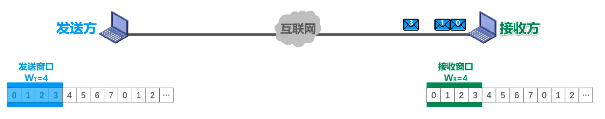

接收方接收 0,1 分组，接收窗口向前滑动两格，之后接收 3 分组，给 3 分组打上标记（为了不重复接收）但不滑动窗口。接收方返回 ACK 0,1,3。（此时接收方可择机将已按序接受的 0,1 分组交付上层处理）

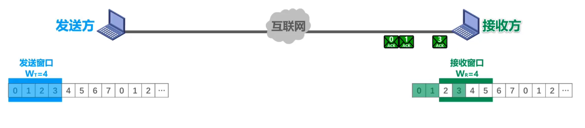

接收方接收到 ACK 0,1，发送窗口向前滑动两格，并将新落入窗口的 4,5 分组发送出去，将已经出窗口的 0,1 分组从发送缓存中删除。接收方接收到 ACK 3，但窗口不能向前滑动，因为这是一个未按序到达的确认分组，因此只记录 3 号分组已确认，这样 3 号分组就不会超时重传。

之后接收方收到 4,5 分组，标记但接收窗口不滑动，返回 ACK 4,5；发送方接收到 ACK 4,5，发送窗口一样不滑动。

再之后 2 号分组超时重传，接收方收到 2 分组，接收窗口头部滑动到 6，返回 ACK 2，发送方接收到 ACK 2，发生窗口头部滑动到 6，发送 6,7,0,1 分组，以此类推。

**如果设置的 $W_T$ 超过范围取值**

首先需要注意一下，回退 N 帧中，$W_T \leq (2^n)-1$，选择重传中 $W_T \leq 2^{(n-1)}$，两者并不一样。为什么范围不一样看了下面就应该能理解了，因为除了发送窗口，还需要给接收窗口留空间。

例如上例取 $W_T=5, W_R =5$，会有什么问题？

来看实例：

此时发送方发送完了 0~4 的数据，接收方成功接收，但 ACK 0 丢失，发送方超时重传，重传 0 分组，但接收方的接收窗口中也包含 0 分组，此时就无法分辨到来的 0 分组究竟是新分组还是重发的旧分组。因此 $W_R$ 必须 $\leq$ $2^{n-1}$，才能保证新旧分组中不会出现相同的序号。

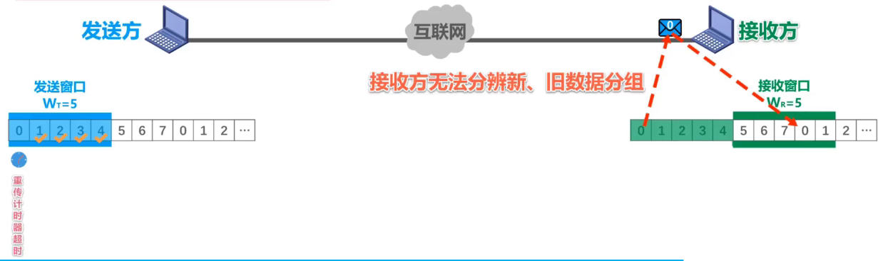

## *PPP 协议*

### 概述

点对点协议 PPP(Point-to-Point Protocol) 是目前使用最广泛的点对点数据链路层协议。

用户计算机与 ISP 进行通信时，所使用的数据链路层协议通常就是 PPP 协议。在 1999 年公布的在以太网上运行的 PPP 协议，即 PPP over Ethernet，简称为 PPPoE，它使得 ISP 可以通过 DSL、电路调制解调器、以太网等宽带接入技术，以以太网接口的形武为用户提供接入服务。另外，点对点协议 PPP 也广泛应用于广域网路由器之间的专用线路。

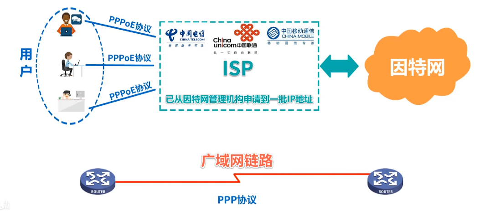

PPP 协议为在点对点链路传输各种协议数据报提供了一个标准方法，主要由以下三部分构成：

* 对各种协议数据报的封装方法(封装成帧)
* 链路控制协议 LCP		用于建立、配置以及测试数据链路的连接
* 一套网络控制协议 NCPs	其中的每一个协议支持不同的网络层协议

PPP 协议能够在多种类型的点对点链路上运行，例如，面向字节的异步链路，面向比特的同步链路。

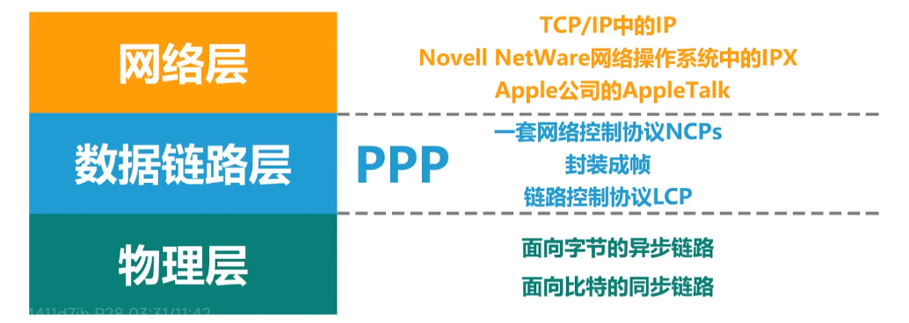

### 帧格式

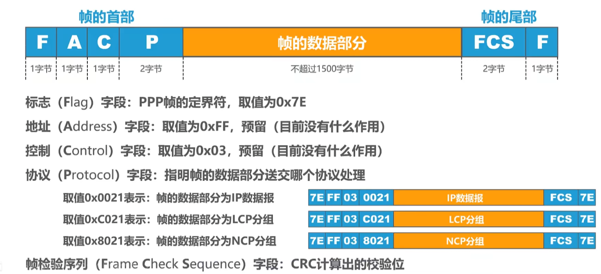

### 透明传输

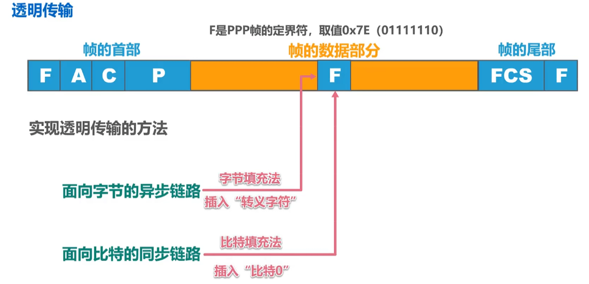

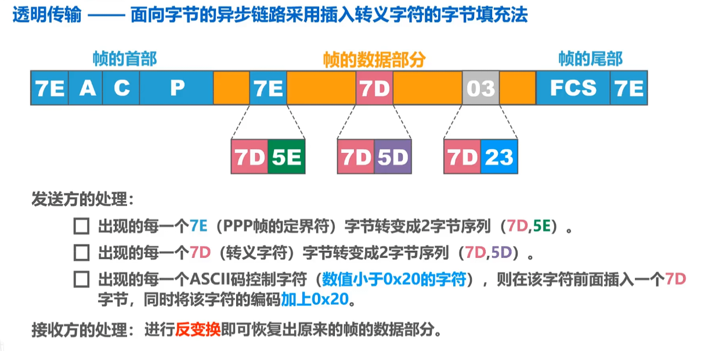

### 差错检测

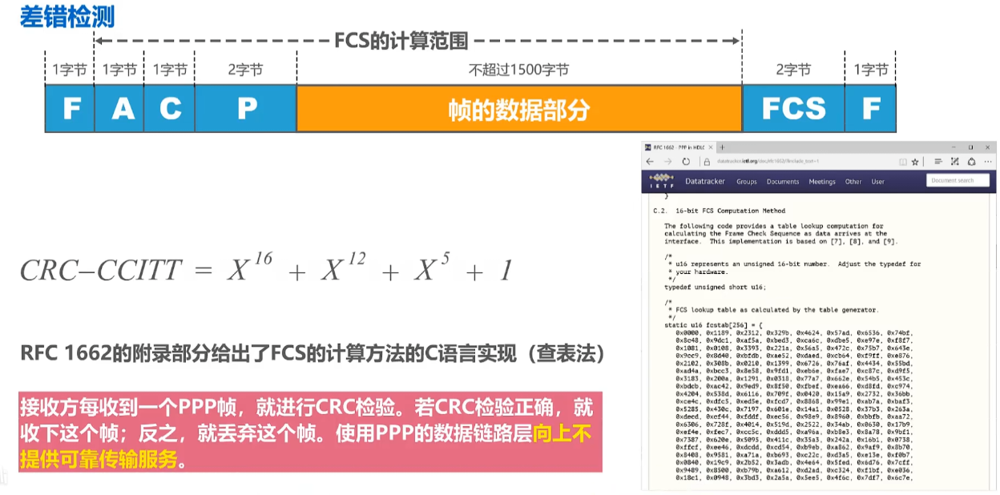

### 工作状态

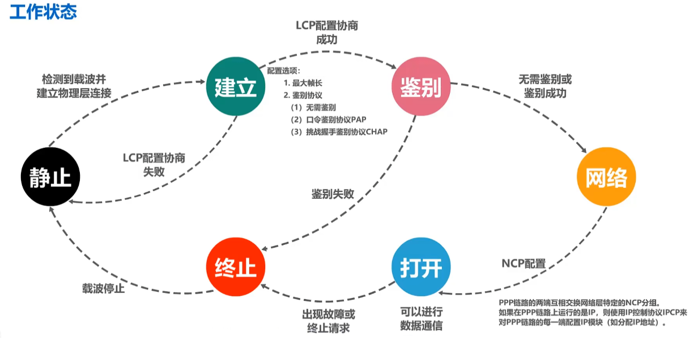

## 媒体介入控制

### 基本概念

共享信道要着重考虑的一个问题就是如何协调多个发送和接收站点对一个共享传输媒体的占用，即**媒体接入控制 MAC **(Medium Access Control)。

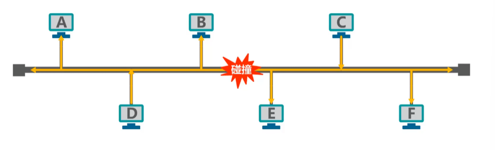

**媒体介入控制**分为：

* **静态划分信道**：预先固定分配好信道，这类方法非常不灵活，对于突发性数据传输信道利用率会很低。通常在无线网络的物理层中使用，而不是在数据链路层中使用。
  * **频分多址**
  * **时分多址**
  * **码分多址**
* **动态接入控制**
  * **受控接入**（现已被淘汰）
    * **集中控制**：有一个主站以循环方式轮询每个站点有无数据发送，只有被轮询到的站点才能发送数据。最大缺点是存在单点故障问题。
    * **分散控制**：各站点是平等的，并连接成一个环形网络。令牌(一个特殊的控制帧)沿环逐站传递，接收到令牌的站点才有权发送数据，并在发送完数据后将令牌传递给下一个站点。
  * **随机接入**：所有站点通过竞争随机地在信道上发送数据。如果恰巧有两个或更多的站点在同一时刻发送数据，则信导在共享媒体上就要产生碰撞(即发生了冲突)。使得这些站点的发送都失败。因此，这类协议要解决的关键问题是如何尽量避免冲突在发生冲突后如何尽快恢复通信。著名的共享式以太网采用的就是随机接入。

随着技术的发展，交换技术的成熟和成本的降低，具有更高性能的使用点对点链路和链路层交换机的交换式局域网在有线领域已完全取代了共享式局域网，但由于无线信道的广播天性，无线局域网仍然使用的是共享媒体技术。

### 静态划分信道

下介绍**信道复用**：

**复用**（Multiplexing）是通信技术中的一个重要概念。复用就是通过一条物理线路同时传输多路用户的信号。

当网络中传输媒体的传输容量大于多条单一信道传输的总通信量时，可利用复用技术在一条物理线路上建立多条通信信道来充分利用传输媒体的带宽。

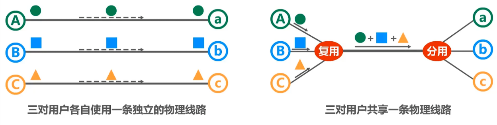

#### 频分复用 FDM

将可用频谱分为多个频带，每个频带分配给一个信号传输。每个信号同时以不同频率传输。

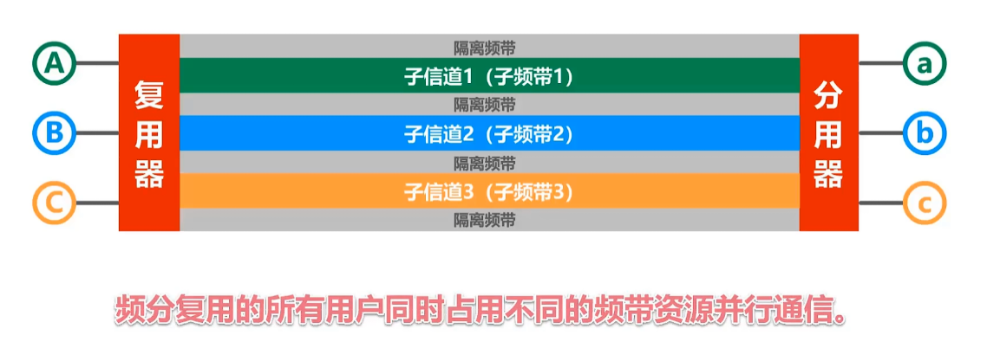

#### 时分复用 TDM

将时间划分为多个时隙，每个信号占用一个固定时隙传输。所有信号按时序顺序发送。

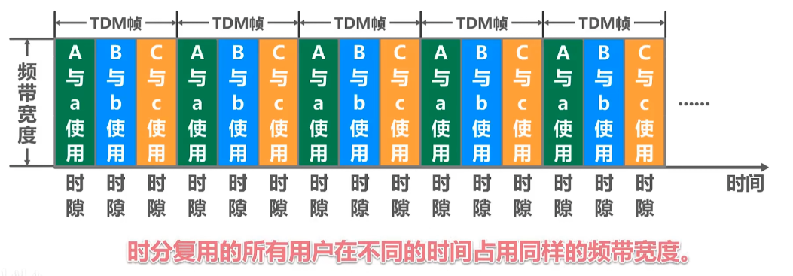

#### 波分复用 WDM

波分复用其实就是光的频分复用。在光纤通信中，通过将不同的光波长分配给不同的信号传输，实现多信号的同时传输。

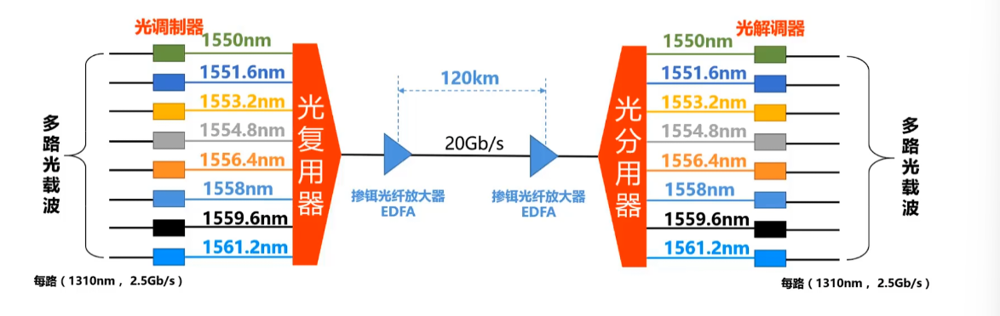

#### 码分复用 CDM

使用不同的编码（如伪随机码）将多个信号在同一时间、同一频率上传输，通过不同的码进行区分。

##### 一些概念和背景

码分复用 CDM 是另一种共享信道的方法。实际上，由于该技术主要用于多址接入，人们更常用的名词是码分多址 CDMA (Code Division Multiple Access)。

同理，频分复用 FDM 和时分复用 TDM 同样可用于多址接入，相应的名词是频分多址 FDMA (Frequency Division Multiple Access) 和时分多址 TDMA (Time Division Multiple Access)。

在本课程中，我们不严格区分复用与多址的概念，可简单理解如下:

* **复用**是将单一媒体的频带资源划分成很多子信道，这些子信道之间相互独立，互不干扰。从媒体的整体频带资源上看，每个子信道只占用该媒体频带资源的一部分。
* **多址**（更确切地应该称为多点接入）处理的是动态分配信道给用户。这在用户仅仅暂时性地占用信道的应用中是必须的，而所有的移动通信系统基本上都属于这种情况。相反，在信道永久性地分配给用户的应用中，多址是不需要的（对于无线广播或电视广播站就是这样）。
* 某种程度上，FDMA、TDMA、CDMA 可以分别看成是 FDM、TDM、CDM 的应用

CDM 最初是用于军事通信的，因为这种系统所发送的信号有很强的抗干扰能力，其频谱类似于白噪声，不易被敌人发现。随着技术的进步，CDMA 设备的价格和体积都大幅度下降，因而现在已广泛用于民用的移动通信中。

##### 正式介绍

与 FDM 和 TDM 不同，CDM 的每一个用户可以**在同样的时间使用同样的频带进行通信**。由于**各用户使用经过特殊挑选的不同码型**，因此各用户之间**不会造成干扰**。

CDMA 中，每一个比特时间再划分为 m 个短的间隔，称为**码片** (Chip)。通常 m 的值是 64 或 128 。为了简单起见，在后续的举例中，我们假设 m 为 8 。

使用 CDMA 的每一个站被指派一个唯一的 **m bit 码片序列** (Chip Sequence)。

* 一个站如果要发送比特 1，则发送它自己的 m bit **码片序列**；
* 一个站如果要发送比特 0，则发送它自己的 m bit **码片序列的二进制反码**；

【举例】

* 指派给 CDMA 系统中某个站点的码片序列为     00011011
* 发送比特 1：发送自己的码片序列             00011011
* 发送比特 0：发送自己的码片序列的二进制反码  11100100
* 为了方便，我们按惯例将码片序列中的 0 写为 -1，将 1 写为 +1。则该站点的码片序列是 (-1 -1 -1 +1 +1 -1 +1 +1)。

码片序列的挑选原则如下:

1. 分配给每个站的**码片序列必须各不相同**，实际常采用伪随机码序列。
2. 分配给每个站的**码片序列必须相互正交**（规格化内积为0）。

令向量 S 表示站 S 的码片序列，令向量 T 表示其他任何站的码片序列。

两个不同站 S 和 T 的码片序列正交，就是向量 S 和 T 的规格化内积为 0（0 换成 -1 之后向量点乘除序列长度）：
$$
\begin{aligned}
S \cdot T & \equiv 0 \qquad S \cdot \overline{T} \equiv 0 \\
S \cdot S & \equiv 1 \qquad S \cdot \overline{S} \equiv -1 \\
\end{aligned}
$$

这样，我们只需要拿这个站点的码片序列乘一下接收到的复合信息，就能知道该站点在此时刻有无发送数据，发送的是 0 还是 1 。

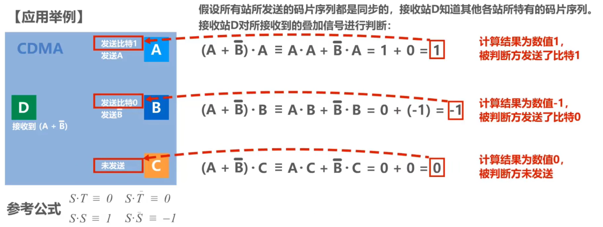

**正交向量的极限**

在 $N$ 维空间中最多只能有 $N$ 个互相正交的向量，因此每个码片序列长度为 $m$ bit 时，可使用 Walsh-Hadamard 变换生成 $m$ 个彼此正交的向量，也就是最多可以分配 $m$ 个码片序列。

##### 习题

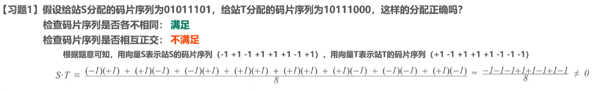

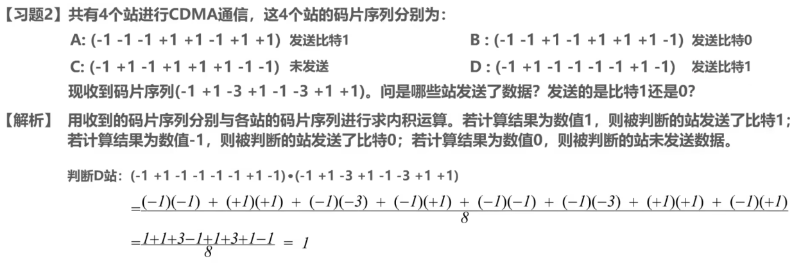

### 动态接入控制 -- 随机接入

#### CSMA/CD 协议

学前提示：

* CSMA/CD 协议曾经用于各种总线结构以太网和双绞线以太网的早期版本中，现在的以太网基于交换机和全双工连接，不会有碰撞，因此没有必要使用 CSMA/CD 协议。
* 但 CSMA/CD 协议是经典以太网的核心机制，它对于避免碰撞以及发生碰撞后的处理都很有意思，思想值得借鉴；同时也可以了解以太网从 **共享总线（Hub）** 到 **交换式全双工（Switch）** 的发展过程；此外，它也有助于理解用于无线网络的 CSMA/CA 协议。

##### 基本原理

在总线形网络中，各计算机之间可能发生如下碰撞：

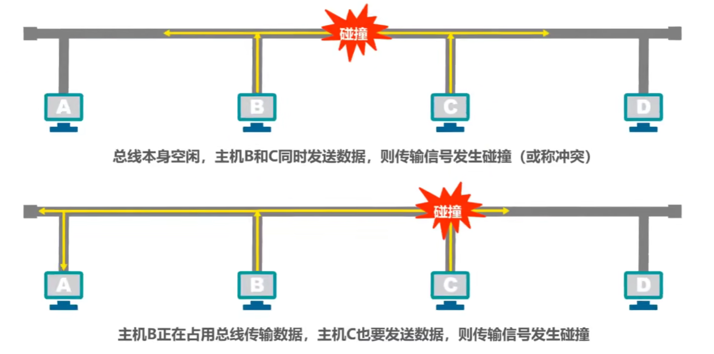

于是早期互联网采用 CSMA/CD 协议来协调总线上各主机的工作，尽量避免碰撞。

CSMA/CD 指：

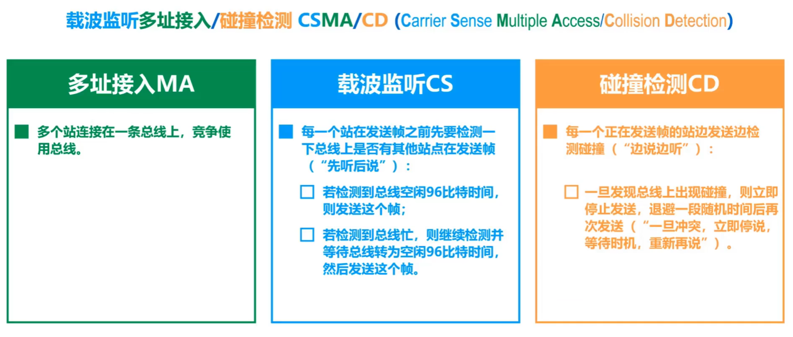

**载波监听**保证了当前主机发现有其他主机在发送数据时，不会再发送数据导致碰撞。不过，当有其他主机的数据在总线上传播但又没传播到当前主机时，当前主机依旧可能会发送消息，这样两个消息便在中途碰撞，此时就需要**碰撞检测**。当碰撞的数据传播到当前主机，主机便知道此消息发送失败，于是退避随机时间重新发送，以此避开碰撞。

以太网还采取了一种叫做**强化碰撞**的措施，就是当发送帧的主机一旦检测到碰撞，除了立即停止发送帧外，还要再继续发送 32 比特或 48 比特的人为干扰信号(Jamming signal)，以便有足够多的碰撞信号使所有站点都能检测出碰撞。

##### 争用期

**争用期**是指多个节点在检测到空闲后，同时开始竞争使用该信道，可能会导致数据传输冲突的那段时间。

一个发生碰撞例子：

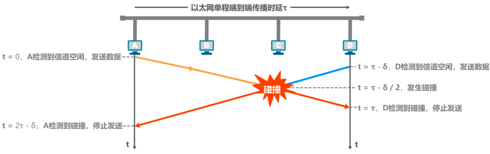

由上例可知：

* 主机最多经过 $2\tau$ (即 $\delta→0$) 的时长就可检测到本次发送是否遭受了碰撞。
* 因此，以太网的端到端往返传播时延 $2\tau$ 称为**争用期**或**碰撞窗口**。
* 经过争用期这段时间还没有检测到碰撞，才能肯定这次发送不会发生碰撞。
* 每一个主机在自己发送帧之后的一小段时间内，存在着遭遇碰撞的可能性。这一小段时间是不确定的。它取决于另一个发送帧的
  主机到本主机的距离，但不会超过总线的端到端往返传播时延，即一个争用期时间。
* 显然，在以太网中发送帧的主机越多，端到端往返传播时延越大，发生碰撞的概率就越大。因此，**共享式以太网不能连接太多的**
  **主机，使用的总线也不能太长**。
  * 10 Mb/s 的以太网把争用期定为 512 比特发送时间，即 51.2us，因此其总线长度不能超过 5120m，但考虑到其他一些因素，如信号衰减等，以太网规定总线长度不能超过 2500m 。

##### 最小帧长

**最小帧长**的设置主要是为了**确保主机可在帧发送完成之前就检测到该帧的发送过程中是否遭遇了碰撞**，如果数据帧太短，发送端可能在碰撞信号返回之前已经发送完毕，导致无法有效检测到冲突，从而影响网络的可靠性和性能。

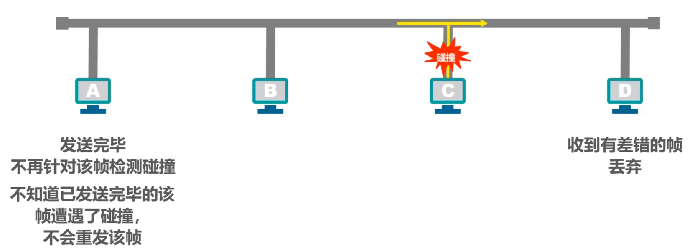

**以太网规定最小帧长为 64 字节**，即 512 比特(512 比特时间即为争用期)，如果要发送的数据非常少，那么必须加入一些填充字节，使帧长不小于64字节。

如果在争用期(共发送 64 字节)没有检测到碰撞，那么后续发送的数据就一定不会发生碰撞；

如果在争用期内检测到碰撞，就立即中止发送，这时已经发送出去的数据一定小于 64 字节，因此**凡长度小于 64 字节的帧都是由于碰撞而异常中止的无效帧**。

##### 最大帧长

**最大帧长**的设定主要是为了限制网络中单个帧的传输时间，防止某个节点长时间占用信道，影响其他节点的公平竞争，也防止导致接收主机的接收缓冲区无法装下该帧而产生溢出。

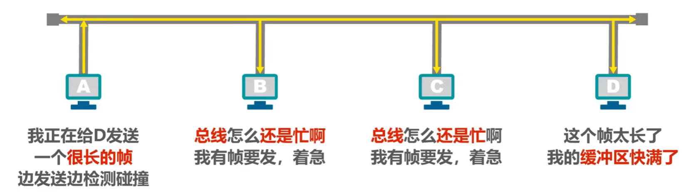

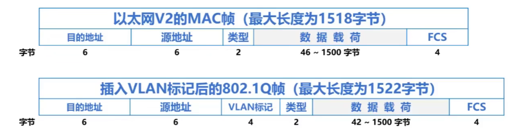

##### 截断二进制指数退避算法

主机发现碰撞发生后，按照 CSMA/CD 协议使用**截断二进制指数退避（Truncated Binary Exponential Backoff, TBEB）**算法来处理冲突后的重传调度。

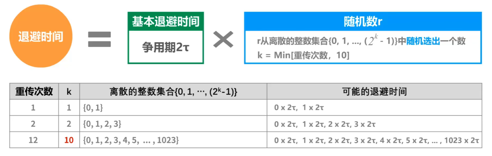

若连续多次发生碰撞，就表明可能有较多的主机参与竞争信道。但使用上述退避算法可**使重传需要推迟的平均时间随重传次数而增大**(这也称为**动态退避**)，因而**减小发生碰撞的概率**，有利于整个系统的稳定。

**当重传达 16 次仍不能成功时**，表明同时打算发送帧的主机太多，以至于连续发生碰撞，则**丢弃该帧**，并向高层报告

##### 信道利用率

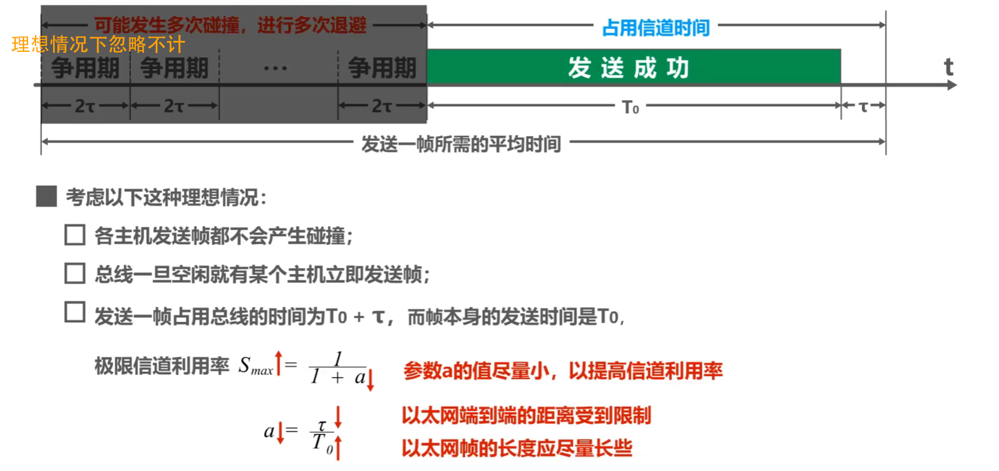

##### 帧发送流程图

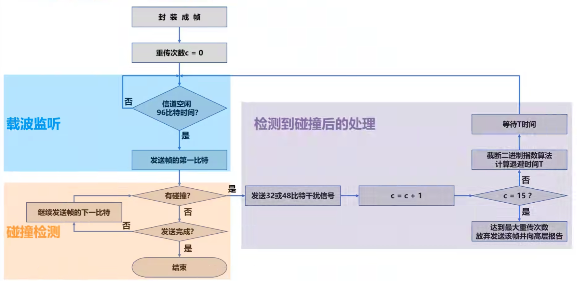

##### 帧接收流程图

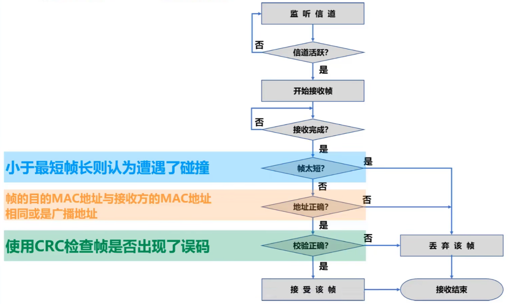

#### CSMA/CA 协议

##### 基本原理

**CSMA/CA** (Carrier Sense Multiple Access/Colision Avoidance) 即载波监听多址接入/碰撞避免，是一种主要用于无线局域网（如 Wi-Fi）的介质访问控制协议。由于无线网络中无法像有线网络那样实时检测碰撞，CSMA/CA 通过**预防措施**来**尽量**避免数据碰撞。

由于**不可能避免所有的碰撞**，并且**无线信道误码率较高**，802.11 标准还使用了**数据链路层确认机制(停止-等待协议)**来保证数据被正确接收，作为**保证可靠传输**的兜底手段。

不能实时检测碰撞的原因如下:

* 由于无线信道的传输条件特殊，其信号强度的动态范围非常大，无线网卡上接收到的信号强度往往会远远小于发送信号的强度(可能相差百万倍)。如果要在无线网卡上实现碰撞检测 CD，对硬件的要求非常高。
* 即使能够在硬件上实现无线局域网的碰撞检测功能，但由于无线电波传播的特殊性(存在隐蔽站问题)，进行碰撞检测的意义也不大。
* 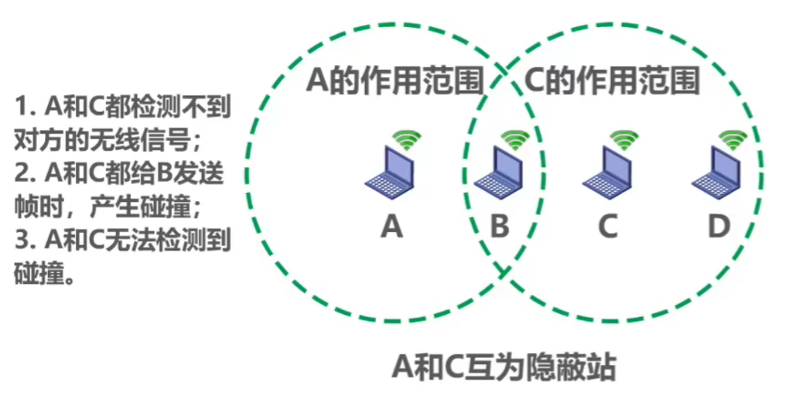

802.11 的 MAC 层标准定义了两种不同的媒体接入控制方式:

* **分布式协调功能 DCF**(Distributed Coordination Function)。在 DCF 方式下，没有中心控制站点，每个站点使用 CSMA/CA 协议通过争用信道来获取发送权，这是 802.11 定义的默认方式。
* **点协调功能 PCF**(Point Coordination Function)。PCF 方式使用集中控制的接入算法(一般在接入点 AP 实现集中控制)，是 802.11 定义的可选方式，在实际中较少使用。

##### 碰撞避免 CA 工作原理 

802.11 标准规定，**所有的站点必须在持续检测到信道空闲一段指定时间后才能发送帧**，这段时间称为帧间间隔 IFS。

帧间间隔的长短取决于该站点要发送的帧的类型：

* 高优先级帧需要等待的时间较短，因此可优先获得发送权;
* 低优先级帧需要等待的时间较长。若某个站的低优先级帧还没来得及发送，而其他站的高优先级帧已发送到信道上，则信道变为忙态，因而低优先级帧就只能再推迟发送了。这样就减少了发生碰撞的机会。

常用的两种帧间间隔如下：

* **短帧间间隔：SIFS**(short Interframe Space)(28us)，是最短的帧间间隔，用来**分隔开属于一次对话的各帧**。**一个站点应当能够在段时间内从发送方式切换到接收方式**。使用 SIFS 的帧类型有 ACK 帧、CTS 帧、由过长的 MAC 帧分片后的数据帧、以及所有回答 AP 探询的帧和在 PCF 方式中接入点 AP 发送出的任何帧。
* **DCF 帧间间隔：DIFS**(DCF Interframe Space)(128us)，它比短帧间间隔 SIFS 要长得多，在 DCF 方式中用来发送数据帧和管理帧。

**来看一个例子**：

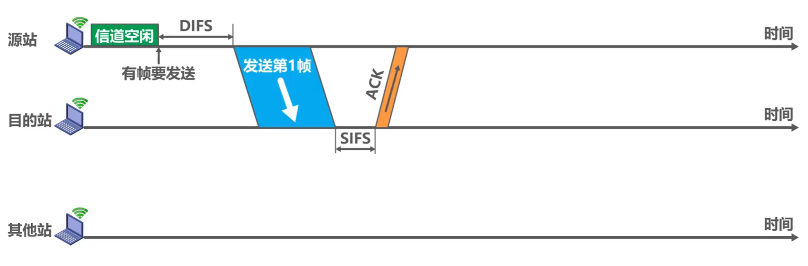

假设无线信道是空闲的，源站有数据帧要发送，当源站检测到信道空闲，则在 DIFS 后发送该数据帧。目的站若正确收到该数据集帧，则经过 SIFS 后，向源站发送确认帧 ACK。若源站没有在规定时间内收到 ACK，就会超时重传。

这里有两个问题：

* 为什么要源站检测到信道空闲，还要等 DIFS 后发送数据帧？因为需要考虑有其他的站有高优先级的帧（如 ACK，CTS 等控制帧）要发送，若有，则让高优先级帧先发送。
* 为什么目的站收到数据集帧后，还要等 SIFS 后发送确认帧 ACK？因为 SIFS 是最短的帧间间隔，用来分隔开属于一次对话的各帧，源站和目的站都需要这一段时间切换自己的发送/接收状态。

我们继续：

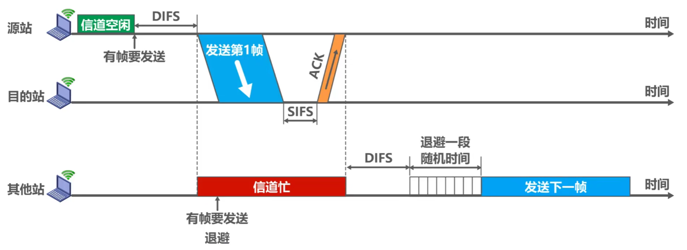

如图所示，在源站和目的站的这次对话过程中，无线信道处于忙状态，此时如果有其他无线站点要发送数据，则必须退避。当信道从忙状态转换到空闲状态，并经过 DIFS 后，其它要发送数据的无线站点需要退避一段随机时间后才能发送。

问题又来了：

* 为什么其它站在检测到信道空闲，并经过 DIFS 后，还要退避一段随机时间才能使用信道呢？因为要防止多个站点同时发送数据而产生碰撞。

我们来看看必须使用退避算法的情况:

* 在发送数据帧之前检测到信道处于忙状态时（多个站点可能同时竞争信道）；
* 在每一次重传一个数据帧时（碰撞已经发生，多个重传的站点可能会再次发生碰撞）；
* 在每一次成功发送后要连续发送下一个帧时（避免一个站点长时间占用信道）。

因此，当站点检测到信道是空闲的，并且所发送的数据帧不是重传也不是成功发送完上一个数据帧之后立即连续发送的数据帧时才不使用退避算法。

##### 退避算法

在执行退避算法时，站点为退避计时器设置一个随机的退避时间：

* 当退避计时器的时间减小到零时，就开始发送数据;
* 当退避计时器的时间还未减小到零时而信道又转变为忙状态，这时就冻结退避计
  器的数值，重新等待信道变为空闲，再经过时间 DIFS 后，继续启动退避计时器。

在进行第 i 次退避时，退避时间在时隙编号 $\{0，1，…，2^{2+i}-1\}$ 中随机选择一个，然后乘以基本退避时间(也就是一个时隙的长度)就可以得到随机的退避时间。这样做是为了使不同站点选择相同退避时间的概率减少。当时隙编号达到 255 时(对应于第 6 次退避)就不再增加了。

**来看一个例子：**

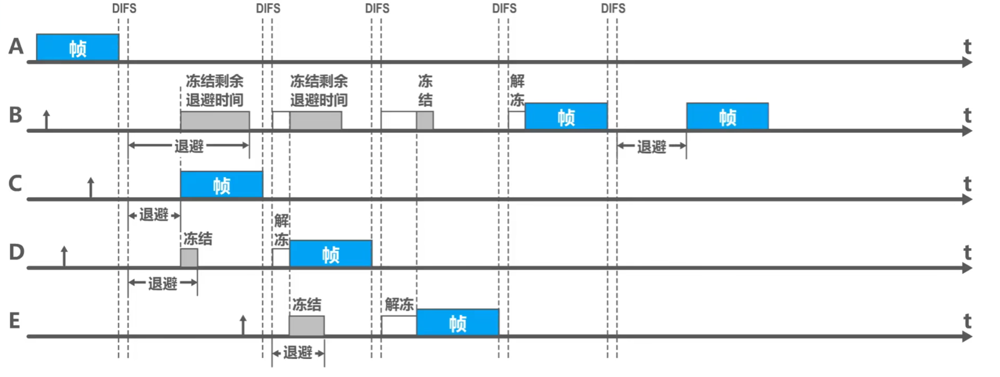

在主机 A 发送帧时，也想发送帧的主机 B、C、D 发现信道正忙，于是获得了一个随机退避时间，退避时间只有在信道空闲时才会减小，先减小为 0 的主机先开始发送数据，其它主机检测到信道又忙了就继续冻结退避时间，等空闲了继续减小。

##### 信道预约

为了**尽可能减少碰撞的概率和降低碰撞的影响**，802.11 标准允许要发送数据的站点**对信道进行预约**。

流程如图：

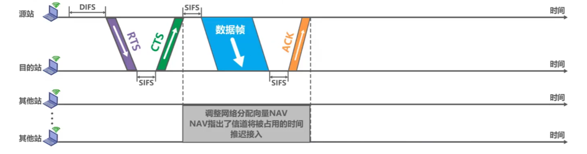

1. 源站在发送数据帧之前先发送一个短的控制帧，称为**请求发送 RTS**(Request To Send)，它包括源地址、目的地址以及这次通信(包括相应的确认帧)所需的持续时间。
2. 若目的站正确收到源站发来的 RTS 帧，且媒体空闲，就发送一个响应控制帧，称为**允许发送 CTS**(Clear To Send)，它也包括这次通信所需的持续时间(从 RTS 帧中将此持续时间复制到 CTS 帧中)。
3. 源站收到CTS帧后，再等待一段时间 SIFS 后，就可发送其数据帧。
4. 若目的站正确收到了源站发来的数据帧，在等待时间 SIFS 后，就向源站发送确认帧 ACK。

除源站和目的站以外的**其他各站**，**在收到 CTS 帧(或数据帧)后就推迟接入到无线局域网中**。这样就保证了源站和目的站之间的通信不会受到其他站的干扰。

如果 RTS 帧发生碰撞，源站就收不到 CTS 帧，需执行退避算法重传 RTS 帧。

由于 **RTS 帧和 CTS 帧很短，发送碰撞的概率、碰撞产生的开销及本身的开销都很小**。而对于一般的数据帧，其发送时延往往大于传播时延(因为是局域网)，碰撞的概率很大，且一旦发生碰撞而导致数据帧重发，则浪费的时间就很多，因此**用很小的代价对信道进行预约往往是值得的**。

802.11 标准规定了 3 种情况供用户选择:

* 使用 RTS 帧和 CTS 帧
* 不使用 RTS 帧和 CTS 帧
* 只有当数据帧的长度超过某一数值时才使用 RTS 帧和 CTS 帧

##### 虚拟载波监听

在 CSMA/CA 中，RTS 帧、CTS 帧和数据帧都会携带通信需要持续的时间，这称为 802.11 的**虚拟载波监听**机制。

由于利用虚拟载波监听机制，**站点只要监听到 RTS 帧、CTS 帧或数据帧中的任何一个，就能知道信道被占用的持续时间**，而不需要真正监听到信道上的信号，因此**虚拟载波监听机制能减少隐蔽站带来的碰撞问题**。

如下图，主机 C 也收到了主机 B 发给主机 A 的 CTS 帧，知道了它们两已经约好了要传输这么长的时间，就在这段时间默默退避了。

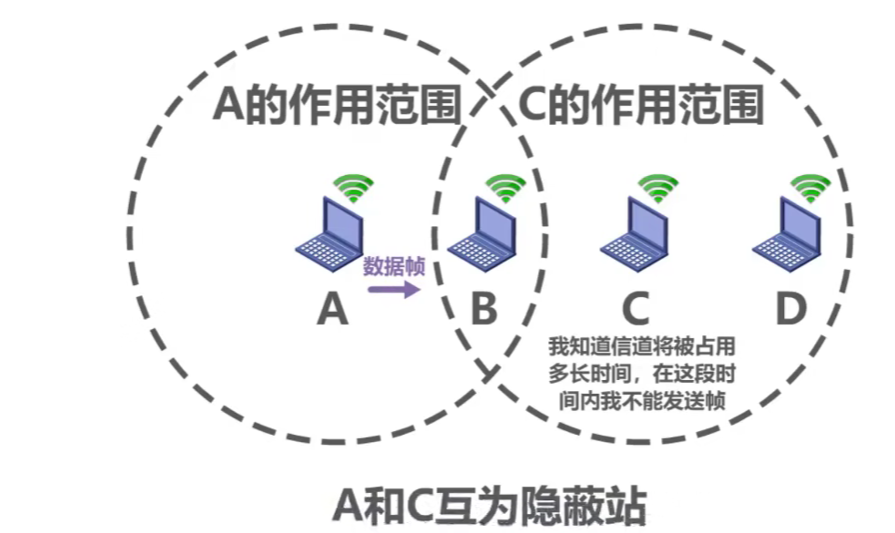

## MAC 地址、IP 地址和 ARP 协议

MAC 地址是以太网的 MAC 子层所使用的地址，属于**数据链路层**。

IP 地址是 TCP/IP 体系结构网际层所使用的地址；属于**网络层**。

ARP 协议属于 TCP/IP 体系结构的网际层，其作用是已知设备所分配到的 IP 地址，使用 ARP 协议可以通过该 IP 地址获取到设备的 MAC 地址；属于**网络层**。

IP 地址和 ARP 协议与 MAC 地址存在一定的关系，并且我们日常的网络应用都离不开 MAC 地址、IP 地址以及 ARP 协议。因此，我们将这三者放在一起讨论。

### MAC 地址

当多个主机连接在同一个广播信道上，要想实现两个主机之间的通信，则每个主机都必须有一个唯一的标识，即一个数据链路层地址；

在每个主机发送的**帧中必须携带标识发送主机和接收主机的地址**。由于这类地址是用于媒体接入控制 MAC(MediaAccess Control)，因此这类地址被称为 **MAC 地址**。

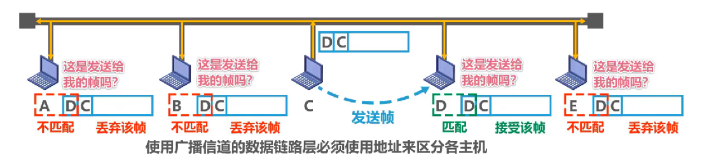

MAC 地址一般被固化在网卡(网络适配器)的电可擦可编程只读存储器 EEPROM 中，因此 MAC 地址也被称为**硬件地址**。

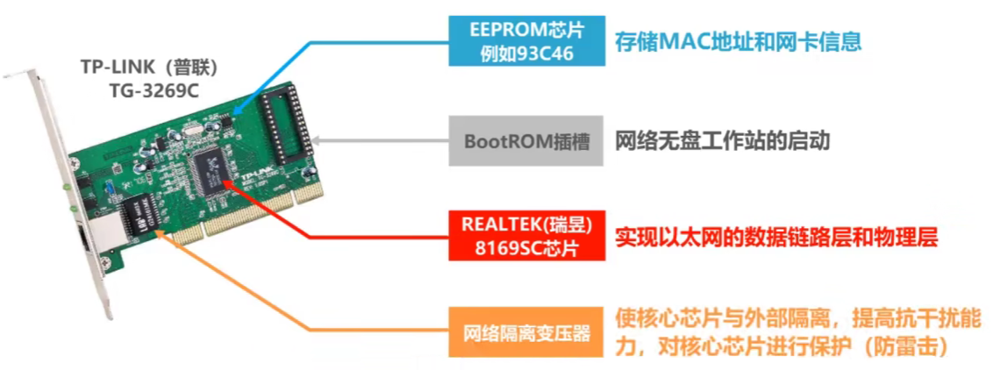

MAC 地址有时也被称为**物理地址**。**请注意：这并不意味着 MAC 地址属于网络体系结构中的物理层！**

一般情况下，用户主机会包含两个网络适配器：有线局域网适配器(有线网卡)和无线局域网适配器(无线网卡)。每个网络适配器都有一个全球唯一的 MAC 地址。而交换机和路由器往往拥有更多的网络接口，所以会拥有更多的 MAC 地址。综上所述，**严格来说，MAC 地址是对网络上各接口的唯一标识，而不是对网络上各设备的唯一标识**。

#### 地址格式

根据 EUI-48（Extended Unique Identifier 扩展唯一标识符) 标准，MAC 地址由 48 位构成，其中前 24 位（3 字节）是组织唯一标识符（OUI），由 IEEE 分配给设备制造商；后 24 位（3 字节）则由制造商自行分配，确保同一厂商生产的每个设备都有唯一的地址。

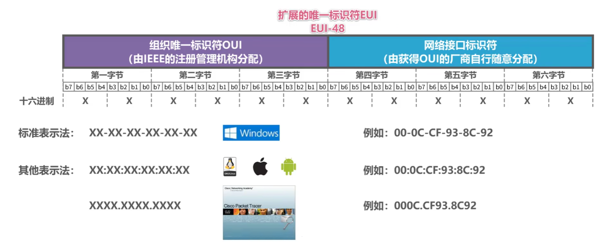

我们可以在 [IEEE 的官方网站](https://standards-oui.ieee.org/oui/oui.txt)查看已分配的组织唯一标识符 OUI 。例如 30-FB-B8 这个 OUI 已被分配给华为科技有限公司，A4-45-19 这个 OUI 已被分配给小米通信有限公司。

MAC 地址第一字节的 b0 位表示单播/组播，第一字节的 b1 位表示全球管理/本地管理。

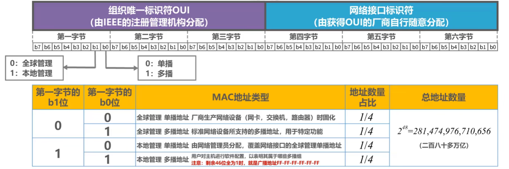

小贴士：如何快速得知一个 MAC 地址是不是多播地址？只需查看该帧的第一个字节能不能被 2 整除，不能整除就是多播地址。

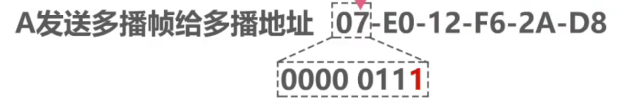

那 EUI-48 地址会耗尽吗？对于使用 EUI-48 空间的应用程序，IEEE 的目标寿命为 100 年(直到 2080)，但是现在鼓励采用 EUI-64 作为替代。

#### 发送顺序

MAC 地址的发送顺序为：

* 字节发送顺序：第一字节 $\rightarrow$ 第六字节
* 字节内的比特发送顺序：$b_0 \rightarrow b_7$ 

#### 例子

**单播 MAC 地址举例**

假设主机 B 要给主机 C 发送消息，主机 B 就在目的地址字段填入主机 C 的 MAC 地址，在源地址字段填入自己的 MAC 地址，帧发送出去后，每个收到帧的主机拿帧中的目的地址与自己的 MAC 地址对比，匹配则接收，不匹配则丢弃。

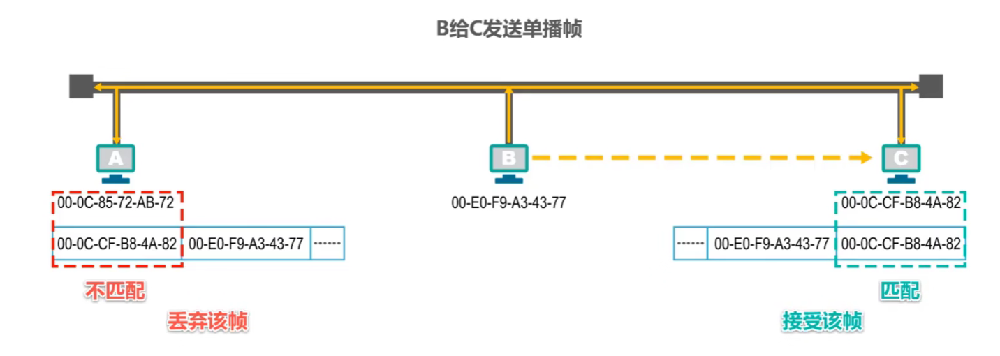

**广播 MAC 地址举例**

假设主机 B 要发送广播消息，主机 B 就在目的地址字段填入广播地址（也就是十六进制的全 F），在源地址字段填入自己的 MAC 地址，帧发送出去后，每个收到帧的主机发现是目的地址是广播地址，于是接收该帧。

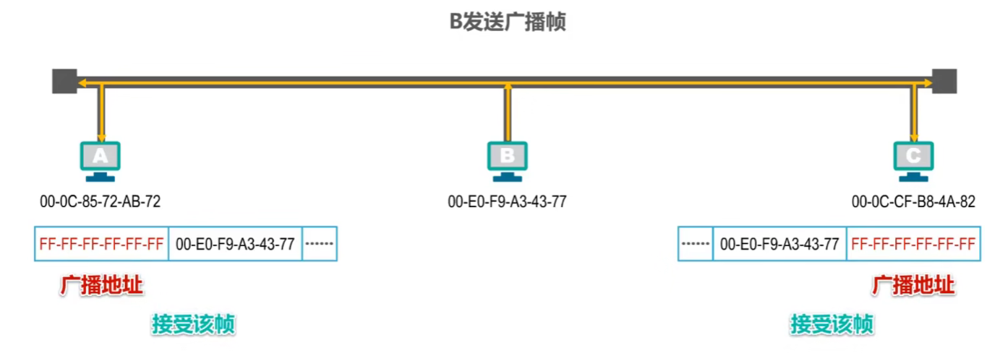

**多播 MAC 地址举例**

假设主机 A 要发送多播消息，主机 A 就在目的地址字段填入多播地址，在源地址字段填入自己的 MAC 地址，帧发送出去后，每个收到帧的主机发现是目的地址是多播地址，如果自己的多播组列表中有匹配的多播地址，则接收该帧，否则丢弃该帧。

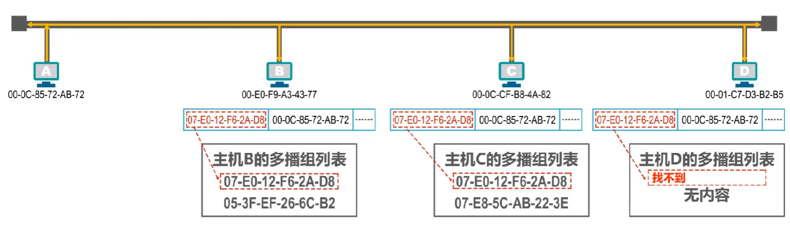

给主机配置多播组列表进行私有应用时，不得使用公有的标准多播地址，具体可在[此网址](http://standards.ieee.org/develop/regauth/grpmac/public.html)查询。

#### 随机 MAC 地址

据斯诺登爆料，美国国家安全局有一套系统，通过监视电子设备的 MAC 地址，来跟踪城市中每个人的行动。因此，苹果率先在 IOS 系列设备扫描网络时采用随机 MAC 地址技术。 随后，windows 10，安卓 6.0，以及内核版本为 3.18 的 Linux 系统也开始提供随机 MAC 地址功能。目前，大多数移动设备已经采用了随机 MAC 地址技术。

### IP 地址

关于 IP 地址的详细介绍留给第四章网络层，本章我们主要介绍 IP 地址的作用。

IP 地址是因特网(Internet)上的主机和路由器所使用的地址，用于标识两部分信息：

* 网络编号：标识因特网上数以百万计的网络
* 主机编号: 标识同一网络上不同主机(或路由器各接口)

很显然，之前介绍的 MAC 地址不具备区分不同网络的功能。

* 如果只是一个单独的网络，不接入因特网，可以只使用 MAC 地址(这不是一般用户的应用方式)
* 如果主机所在的网络要接入因特网，则 IP 地址和 MAC 地址都需要使用。

如下图所示，假设这是因特网的一部分，我们给网络 N8 上的两台主机各分配了一个 IP 地址，给路由器 R4 连接该网络的接口也分配了一个 IP 地址。

这三个 IP 地址的前三个十进制数是相同也就是网络 N8 的编号；而最后一个十进制数各不相同，是网络 N8 上各主机和路由器接口的编号。

换句话说同一个网络上的各主机和路由器的各接口的 IP 地址的网络号部分应该相同，而主机号部分应该互不相同。

在因特网中，不同网络的网络编号必须各不相同，例如在本例中网络 N8 的编号为 192.168.0 而网络 N9 的编号为 192.168.1 。

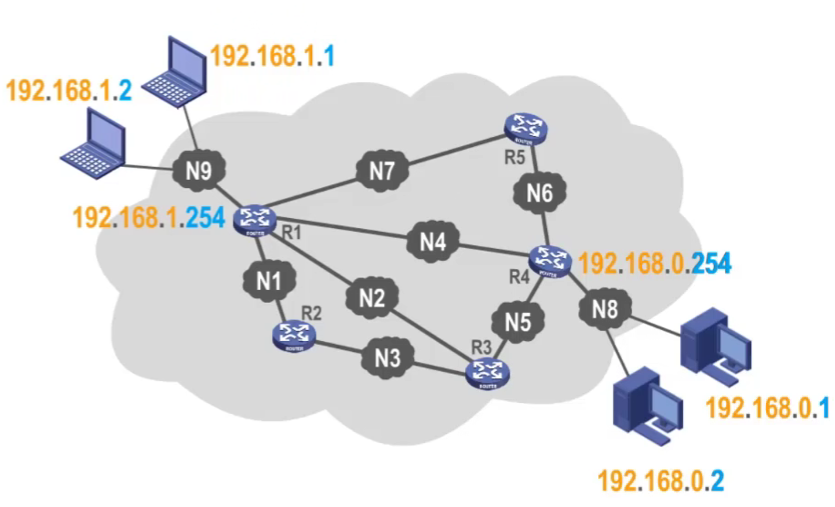

**从网络体系结构看 IP 地址和 MAC 地址**：

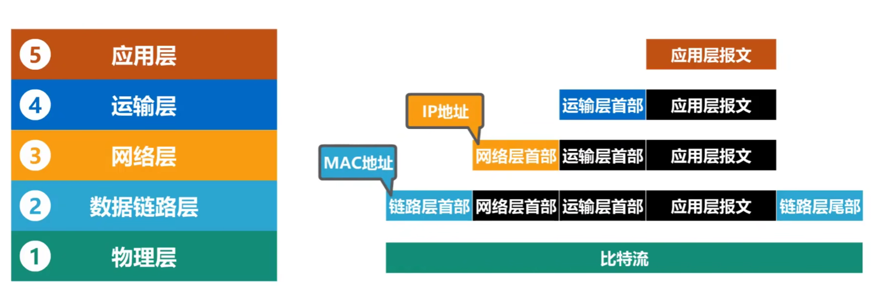

**数据包转发过程中 IP 地址与 MAC 地址的变化情况**：

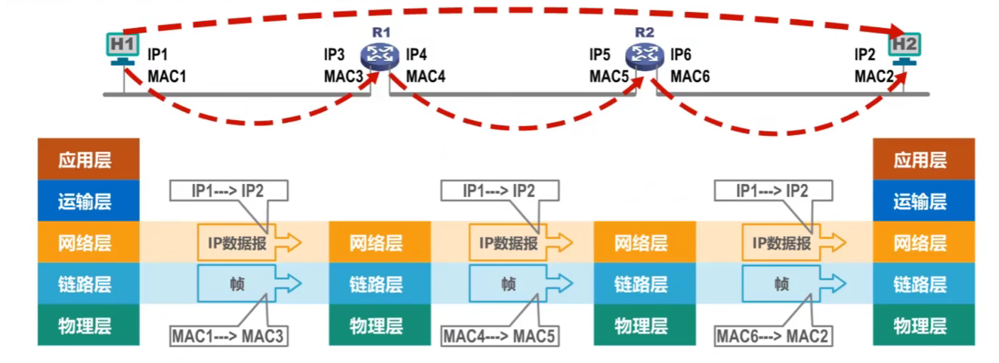

即：

* 源 IP 地址和目的 IP 地址保持不变；
* 源 MAC 地址和目的 MAC 地址逐个链路(或逐个网络)改变。

对于本地主机 H1，路由器 R1 和 R2 都存在一个共同的问题，那就是通过网络层知道了要发送给哪个 IP 地址后，并不知道其对应的 MAC 地址（例如对于 H1 来说，它知道了自己下一步要发送给 IP3，然后让 R1 帮忙继续转发，但它并不知道 IP3 对应的 MAC 地址是什么）。如何通过 IP 地址找出其对应的 MAC 地址，这是我们下面将要介绍的地址解析协议 ARP 所要实现的功能。

### 地址解析协议 ARP

ARP 协议的作用是让主机能够通过已知的 IP 地址找到对应的 MAC 地址，以便在局域网（LAN）内进行数据传输。

实际上，每台主机都会有一个 ARP 高速缓存表，表中记录有 IP 地址和 MAC 地址的对应关系。

例如，下图是主机 B 的 ARP 高速缓存表，上面有主机 B 之前获取到的主机 A 的 IP 地址与 MAC 地址的对应关系：

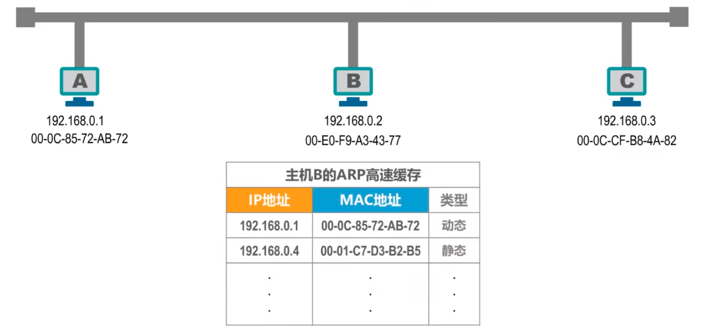

假设主机 B 要给主机 A 发送消息，主机 B 会先检查自己的 ARP 缓存表，发现已经存有 A 机的 MAC 地址，则直接使用该地址发送数据。

假设主机 B 要给主机 C 发送消息，主机 B 检查自己的 ARP 缓存表，发现表中没有 C 机的 MAC 地址，则主机 B 会用**广播**发送一个 **ARP 请求报文**，询问“谁是 192.168.1.3 ？”。ARP 请求报文的形式如下：

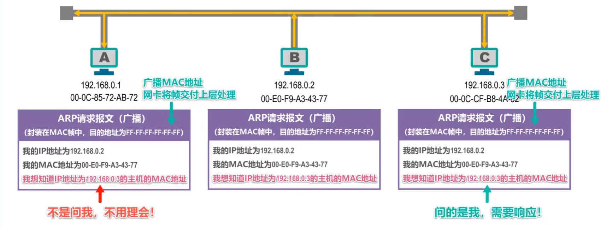

主机 C 收到 ARP 请求报文并确认询问的是自己后，首先将 B 的 IP 地址与 MAC 地址记录到自己的 ARP 高速缓存表中，然后用**单播**给 B 发送 **ARP 响应报文**，以告知自己的 MAC 地址。ARP 响应报文的形式如下：

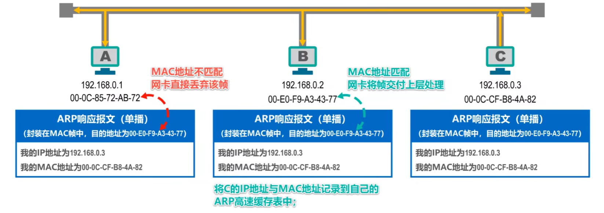

主机 B 收到 ARP 响应报文并交付给上层处理后，上层的 **ARP 进程 **解析 **ARP 响应报文**，将其所包含的主机 C 的 IP 地址与 MAC 地址记录到自己的 ARP 高速缓存表中，如下图所示，主机 B 现在就可以给主机 C 发送之前想发送的数据包了。

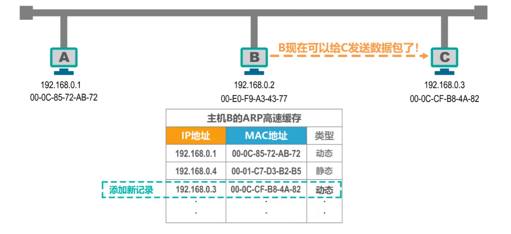

ARP 高速缓存表中的每一条记录，都有其**类型**，类型分为**动态和静态**两种。

动态类型是指记录是主机自动获取到的，其生命周期默认为两分钟，当生命周期结束时该记录将自动删除。这样做的原因是 IP 地址与 MAC 地址的对应关系并不是永久性的，例如当主机的网卡坏了，更换新的网卡后，主机的 IP 地址并没有改变，但主机的 MAC 地址改变了。

静态类型是指该记录是由用户或网络维护人员手工配置的，不同操作系统下的生命周期不同，例如系统重启后不存在或在系统重启后依然有效。

**ARP 的作用范围**：逐段链路或逐个网络使用。

**除 ARP 请求和响应外，ARP 还有其他类型的报文**，例如用于检查 IP 地址冲突的“无故/免费ARP(Gratuitous ARP)”;

ARP 没有安全验证机制，**存在ARP欺骗(攻击)问题**。

## 集线器与交换机

### 集线器

早期的总线型以太网使用粗同轴电缆作为传输媒体，后来引进到使用价格相对便宜的细同轴电缆。

当时那个时代的人们普遍认为有源器件不可靠，而无缘的电缆线才是既简单又可靠的。然而实践表明这种总线型以太网的表现并没有想象的那么可靠。

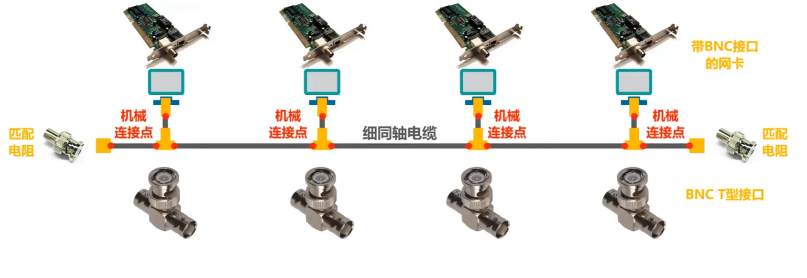

后来以太网发展出来的一种使用大规模集成电路，可靠性非常高的设备叫做**集线器（Hub）**，并且使用更便宜更灵活的双绞线作为传输媒体。如下图所示，这是一个使用集线器和双绞线电缆互连了四台主机的星型拓扑的以太网，主机中的以太网卡以及集线器各接口使用 RJ45 插座，它们之间通过双绞线电缆进行连接，在双绞线电缆的两端是 RJ45 插头（也就是我们俗称的水晶头）。实践证明，这种方式比使用大量机械接头的无源电缆要可靠、便宜、方便的多。

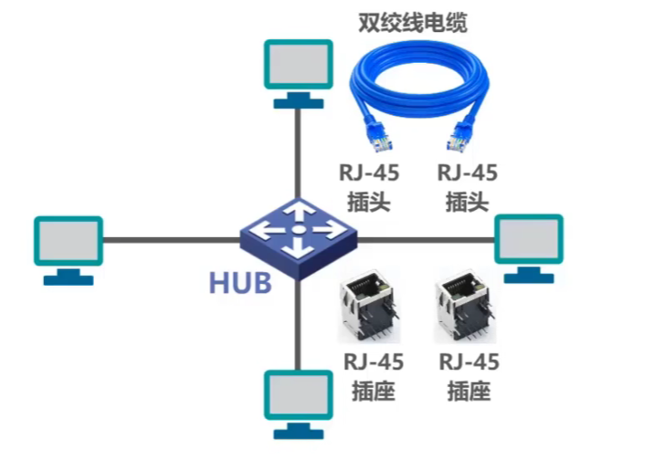

**使用集线器的以太网在逻辑上仍是一个总线网**（尽管它可能和上图一样是星型的结构），各站共享总线资源，**使用的还是 CSMA/CD 协议**。

**集线器只工作在物理层**，它的每个接口仅简单地转发比特，不进行碰撞检测(由各站的网卡检测);

**集线器一般都有少量的容错能力和网络管理功能**。例如，若网络中某个网卡出了故障，不停地发送帧。此时，集线器可以检测到这个问题，在内部断开与出故障网卡的连线，使整个以太网仍然能正常工作。

**使用集线器在物理层扩展以太网**

我们来举例说明，假设某学院下设三个系部，每个系部都有一个使用集线器作为互联设备的以太网。这三个以太网相互独立，各自共享自己的总线资源，是三个独立的碰撞域或称冲突域。例如一系中的某台主机给另一台主机发送数据帧，由于总线特性表示该数据帧的信号会传输到一系中的其他各主机，二系中的多台主机同时发送数据帧，由于总线特性，这必然会产生信号碰撞，碰撞后的信号会传输到二系中的各主机。

为了使各系部的以太网能够相互通信，可再使用一个集线器将它们互联起来。这样原来三个独立的以太网就互联成为了一个更大的以太网，而原来三个独立的碰撞域就合并成了一个更大的碰撞域，换句话说就是形成了一个更大的总线型以太网。例如一系中的某台主机给二系中的某台主机发送数据帧，由于总线特性表示该数据帧的信号会传输到整个网络中的其他各主机（显然碰撞几率增加了）。

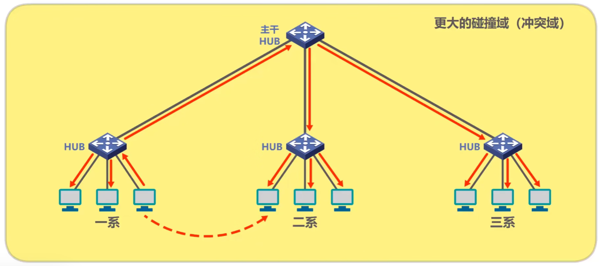

### 交换机

在集线器之后发展出了更先进的网络互联设备，也就是交换机（Switch）。

我们先从一个典型的例子来看看交换机与集线器的区别。

* 使用集线器互联而成的共享总线，当以太网上的某个主机要给另一个主机发送单播帧，该单播真会通过共享总线传输到总线上的其他各个主机。
* 当用交换机互联而成的交换式以太网上的某个主机要给另一个主机发送单播帧，该单播帧进入交换机后，交换机会将该单播帧转发给目的主机，而不是网络中的其他各个主机。

很显然交换机具有明显的优势。

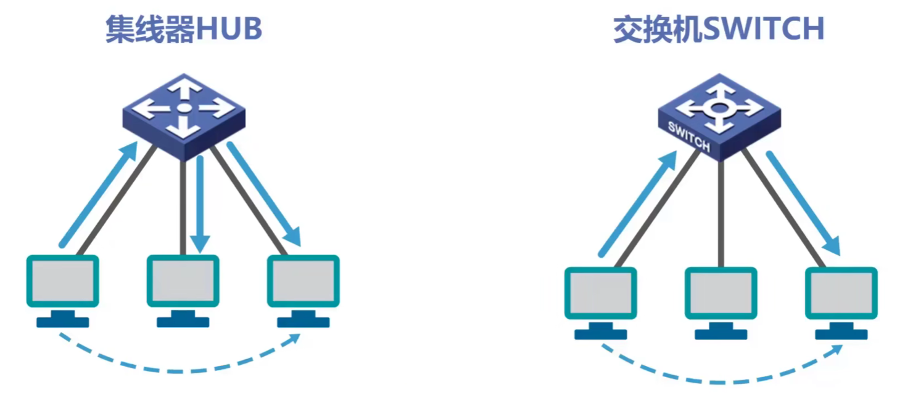

交换机通常都有**多个接口**。每个接口都可以直接与一台主机或另一个交换机相连。一般都工作在**全双工方式**（而集线器需要使用 CSMA/CD 协议来协调各主机征用总线只能工作在半双工模式）。

交换机具有并行性，能**同时连通多对接口**，使多对主机能同时通信，**无碰撞(不使用 CSMA/CD 协议)**。

交换机一般都具有多种速率的接口，例如：10Mb/s、100Mb/s、1Gb/s、10Gb/s 接口的多种组合。

集线器工作在物理层，而交换机工作在**数据链路层**(也包括物理层)，它收到帧后，在帧交换表中查找帧的目的 MAC 地址所对应的接口号，然后通过该接口转发帧。

交换机是一种即插即用设备，其内部的**帧交换表**是通过**自学习算法**自动地逐渐建立起来的。

交换机中帧的两种转发方式:

1. 存储转发
2. 直通交换：采用基于硬件的交叉矩阵(交换时延非常小，但不检查帧是否右差错)

**当网络中的多台主机同时给另一台主机发送单播帧时**

* 对于使用集线器的共享总线型以太网，这必然会产生碰撞，遭遇碰撞的帧会传播到总线上的各主机。
* 对于使用交换机的交换式以太网，交换机收到多个帧时会将它们缓存起来，然后逐个转发给目的主机，不会产生碰撞。
  * 不会发送碰撞的原因：交换机每个端口都是独立的传输介质，所以都是独立的碰撞域。并且，其内部有专用缓存和交换矩阵来并行处理数据，即使数据同时到达，也会先存储在各自的队列中，然后有序地转发出去。

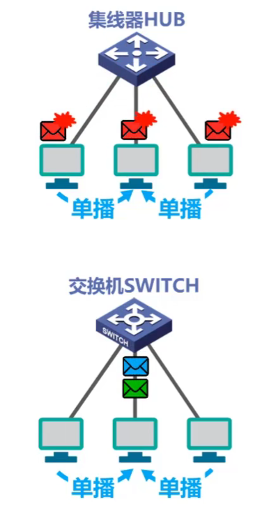

**当使用集线器/交换机扩展以太网时**

发送单播帧的情况：

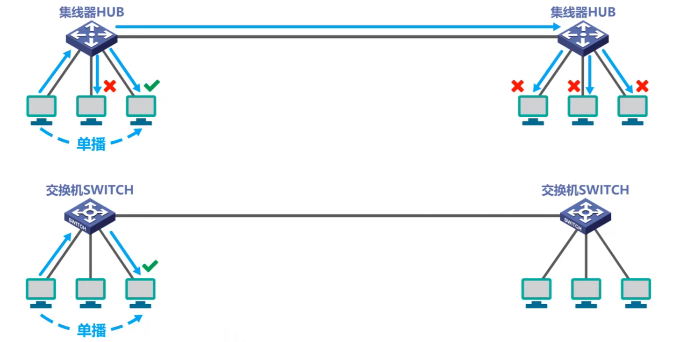

发送广播帧的情况：

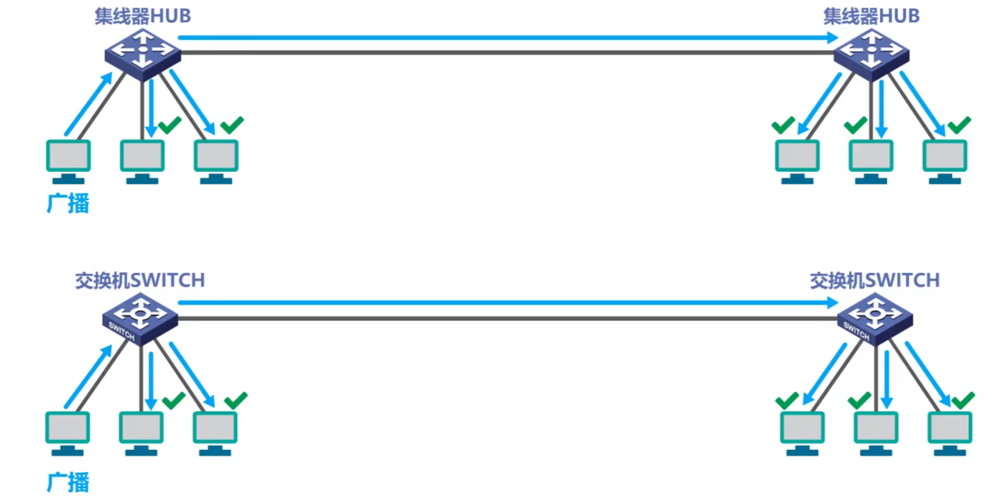

也就是：

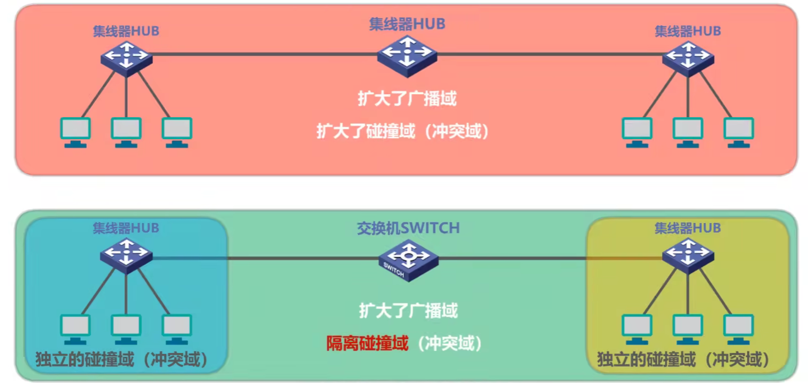

**集线器对比交换机的总结**：

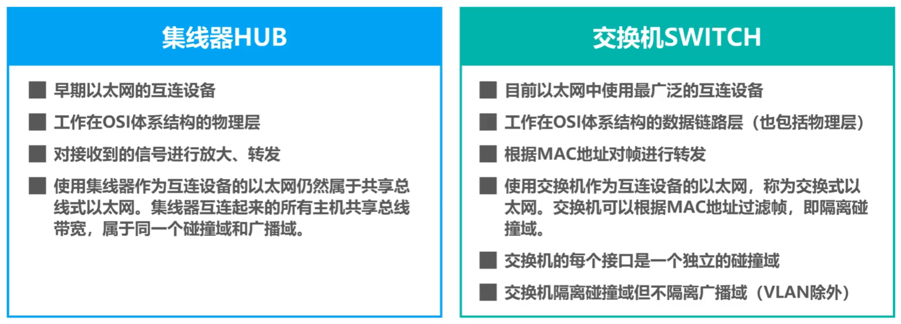

## 交换机自学习和转发帧的流程

以太网交换机工作在**数据链路层**(也包括物理层)，也有部分交换机包含网络层功能，称为三层交换机。

以太网交换机收到帧后，在帧交换表中查找**帧的目的 MAC 地址所对应的接口号**，然后通过该接口转发帧。

以太网交换机是一种即插即用设备，刚上电启动时其内部的帧交换表是空的。随着网络中各主机间的通信以太网交换机**通过自学习算法**自动逐渐**建立起帧交换表**。

**具体流程**：当交换机收到一台主机发送来的帧时会先**记录/更新该主机 MAC 地址对应的接口**，然后查找该 MAC 地址是否存在自己的帧交换表中，如果存在，就**只给这个接口转发消息**，如果不存在，就给**所有的接口都转发消息**（称为**盲目泛洪**）。

下面我们来举例说明该流程，为了方便起见，用一个大写字母表示主机的 MAC 地址，假设每个主机都已经知道其它主机的 MAC 地址了。

这是一个包含两台交换机和三台主机的交换式以太网，初始时帧交换表都是空的：

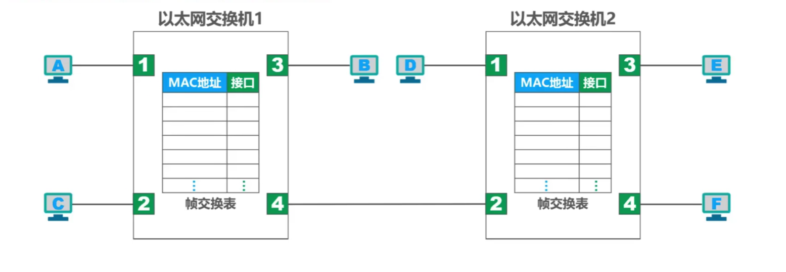

主机 A 给主机 B 发送消息：

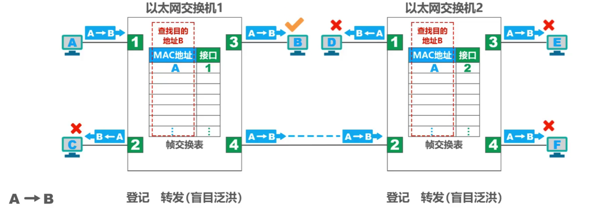

主机 B 给主机 A 发送消息：

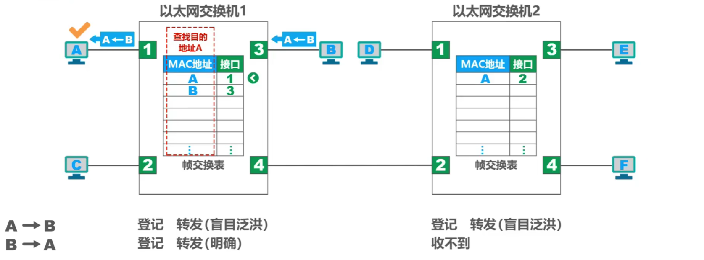

之后，主机 E 给主机 A 发送消息：

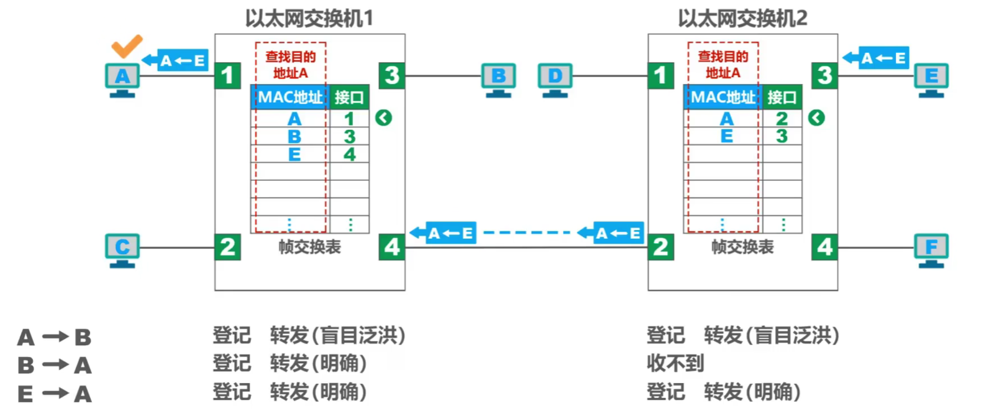

当交换机发现自己要发送的目的接口和帧的来源是同一接口时，会丢弃该帧，如下例。

让我们给接口 1 再连上一台主机 G（用集线器实现），然后让主机 G 给主机 A 发送消息：

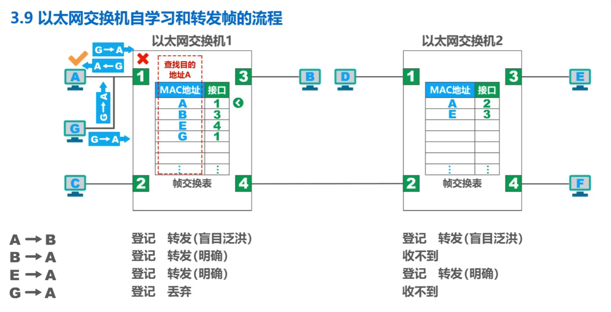

交换机的每条记录都有自己的**有效时间**，到期自动删除。这是因为 MAC 地址与交换机接口的对应关系并不是永久性的。

### 一些思考

假设交换机现在学习了主机 A 和主机 B MAC 地址对应的接口，但是一个熊孩子拔出了这两个接口的水晶头插到了对方那里，那交换机之后想发送给主机 A 的帧不是全都跑到主机 B 去了？不用担心，一旦当主机 A 或主机 B 发送了信息，交换机就会更新它们 MAC 地址对应的新接口；再不济，过个五分钟记录老化，交换机在表中找不到对应接口就会盲目泛洪，消息也能传给正确的主机。

看来交换机每次收到消息时就更新确实是对的，但转念一想，这样会不会影响效率？实际不成问题，如果源地址对应接口没有改变，交换机只会简单地更新该记录的时间戳（延后老化），而不是完全重建映射，以及这种操作是在专用硬件（ASIC）中完成的，速度非常快，对整体转发效率几乎没有影响。

再思考一个问题，交换机只有在收到消息时才会把源地址对应接口记录进表中，那主机 A 一直给主机 B 发送消息，而主机 B 却不回复，那是不是一直都盲目泛洪效率低下呢？其实就算主机 B 不打算发送什么信息，当主机 A 向主机 B 发送数据时，主机 B 的上层协议多半包含可靠传输，也会回复 ACK 帧，这样主机 B 也一样会被交换机记录。再不济，始终都是以泛洪方式转发数据的集线器也好好的工作了这么多年才被淘汰，所以交换机短暂的泛洪也不会对网络造成严重影响。

## 生成树协议 STP

实际应用中，链路可能会发生故障，导致网络无法通信，如下图：

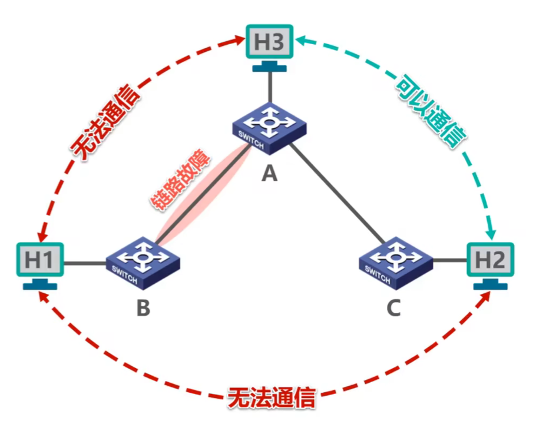

因此，我们可以考虑给网络添加**冗余链路**来提高以太网的可靠性，但是冗余链路也会带来负面效应——形成**网络环路**。

网络环路则会带来以下问题：

* 广播风暴
* 主机收到大量重复的广播帧
* 交换机的帧交换表震荡（漂移）
* 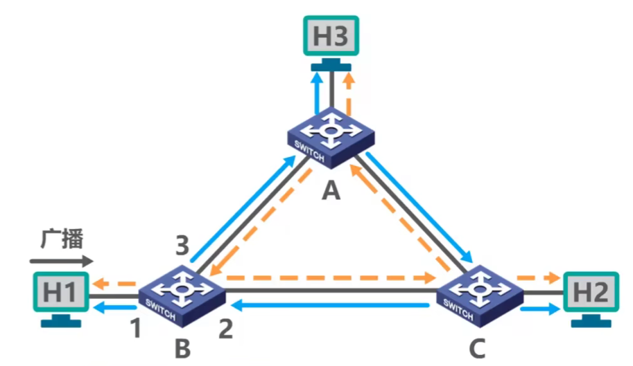

这些都是因为环路重复发送数据产生的，那有没有即保留冗余链路，又避免环路的方法呢？

有的兄弟，有的，**生成树协议**（Spanning Tree Protocol, STP）就是来干这事的，既能阻断冗余链路来消除交换网络中可能存在的环路，又能在链路发生故障时，激活冗余链路，及时恢复网络连通性。

不论交换机之间采用怎样的物理连接，交换机都通过生成树协议自动计算并构建一个逻辑上没有环路的网络，其逻辑拓扑结构必须是树型的(无逻辑环路)，最终生成的树型逻辑拓扑要确保连通整个网络。

当首次连接交换机或网络物理拓扑发生变化时(有可能是人为改变或故障)，交换机都将进行生成树的重新计算，得到在当前状态下可以正常运行的树形网络。

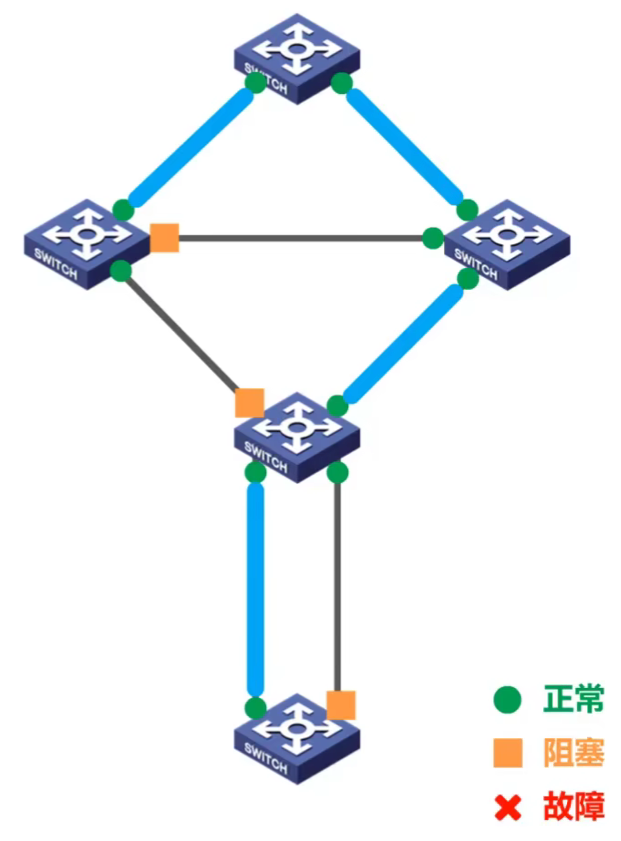

下面我们来看看生成树算法的三个步骤：

1. 选举根交换机
2. 选举根端口
3. 选举指定端口并阻塞备用端口

注意：这里所谓的“选举”，是通过网络中各交换机相互发送生成树协议专用的数据帧 BPDU 来实现的。交换机何时发送 BPDU，BPDU 中又包含着什么信息，我们暂时不管，这有助于我们更轻松地理解生成树算法的三个步骤。

现在介绍下文会用到的名词：

* **网段**：网段是计算机网络中的一个逻辑子网，通常由相同 IP 地址范围的设备组成。在以太网环境中，网段指的是通过交换机或集线器连接的**一组设备**，它们可以在不经过路由器的情况下直接通信。
* **网桥**：网桥是一种网络设备，主要用于连接两个或多个物理或逻辑网段，**使它们能够像同一网络一样通信**。网桥主要用于**二层（数据链路层）**，基于 MAC 地址 进行转发，而不是 IP 地址。

### 选举根交换机

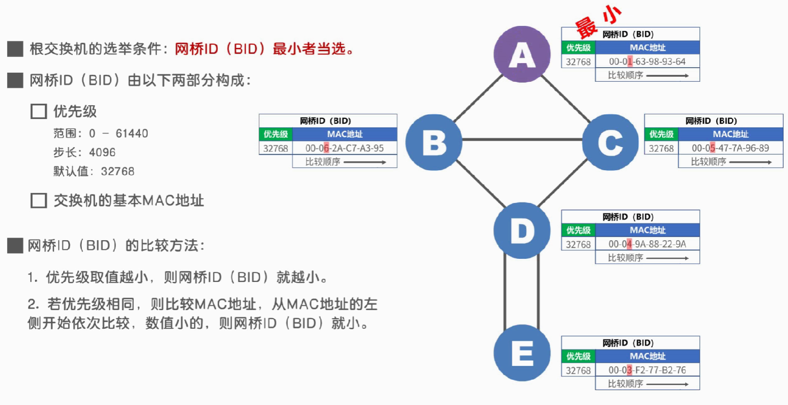

### 选举根端口

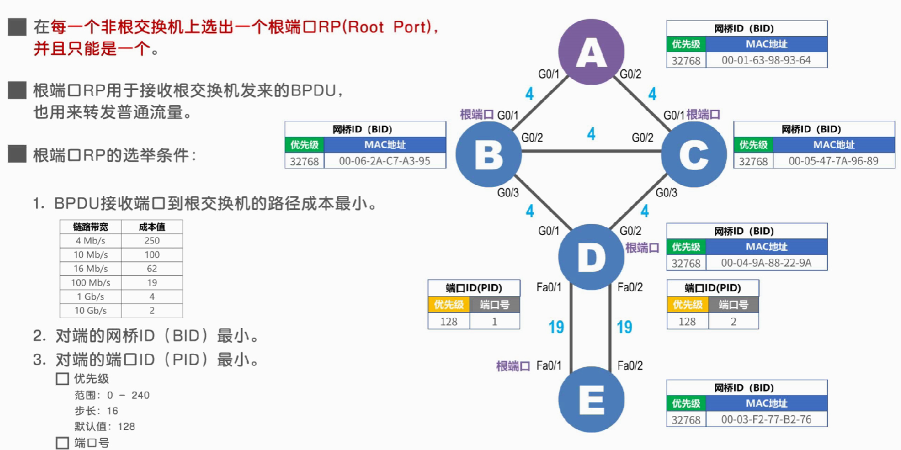

### 选举指定端口并阻塞备用端口

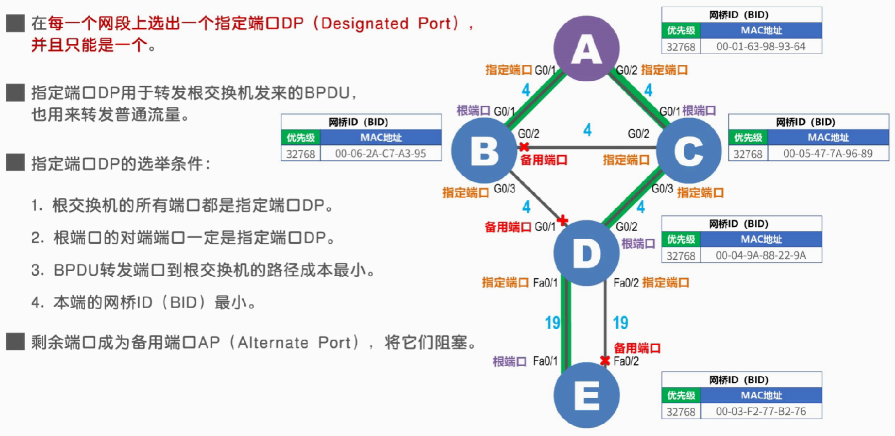

交换机的**根端口**和**指定端口**始终处于**转发状态**，**备用端口**不转发数据但仍可通过指定端口**单向通信**（例如接收 BPDU）。

因为网段是**一组设备**，所以每个网段都要选出一个指定端口，不然这个网段上的设备就接收不到信息了。

## RSTP 和 MSTP

快速生成树协议 RSTP（Rapid Spanning Tree Protocol）和 多生成树协议 MSTP（Multiple Spanning Tree Protocol）都是为了解决传统 STP（Spanning Tree Protocol）收敛速度慢的问题（30-50 秒加快至 1~2 秒），但它们各自侧重点不同：

**RSTP（IEEE 802.1w）**：

- **快速收敛：** RSTP 相对于 STP 最大的优势在于收敛速度大大提高。当链路发生故障时，RSTP 能够在几秒内重新计算并恢复网络，而不需要等待传统 STP 的长时间定时器。
- **端口角色优化：** RSTP 重新定义了端口角色（如边缘端口、点对点端口等），以便更快地判断和应对网络拓扑变化。
- **向后兼容：** RSTP 能与传统 STP 互操作，不过在混合环境中可能无法发挥全部性能优势。

**MSTP（IEEE 802.1s）**：

- **多实例支持：** MSTP 能够在同一个物理网络上为不同的 VLAN 组划分不同的生成树实例，从而使各组流量可以独立计算和优化路径。这解决了在大规模 VLAN 部署中传统 STP 和 RSTP 的单一生成树限制。
- **资源优化：** 通过将 VLAN 分类到不同的实例中，MSTP 可以减少冗余链路资源的浪费，并根据实际流量需求灵活分配网络负载。
- **简化管理：** 对于拥有大量 VLAN 的网络，MSTP 通过映射关系（MSTI 到 VLAN）来简化网络拓扑管理和故障排查。

总之，RSTP 主要改进了 STP 的收敛速度和稳定性，而 MSTP 则在多 VLAN 环境下通过构建多个生成树实例来实现更高效的网络资源利用和流量管理。

## 虚拟局域网 VLAN

使用一个或多个以太网交换机互连起来的交换式以太网，其所有站点都属于**同一个广播域**。随着交换式以太网规模的扩大，广播域相应扩大，而巨大的广播域会带来很多弊端：

* 广播风暴
* 难以管理和维护
* 潜在的安全问题

广播风暴会浪费网络资源和各主机的 CPU 资源，而广播信息又会频繁出现，因此我们应当解决广播域过大的问题。

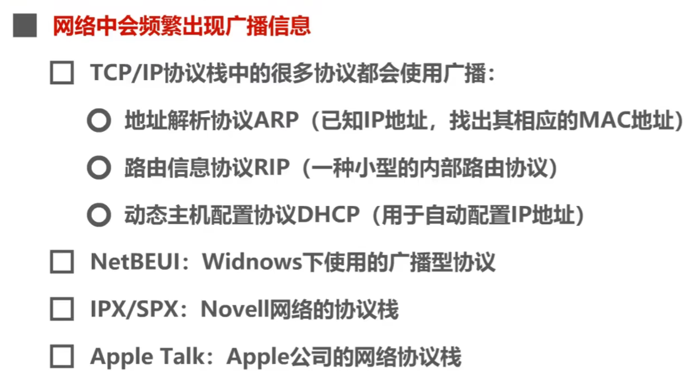

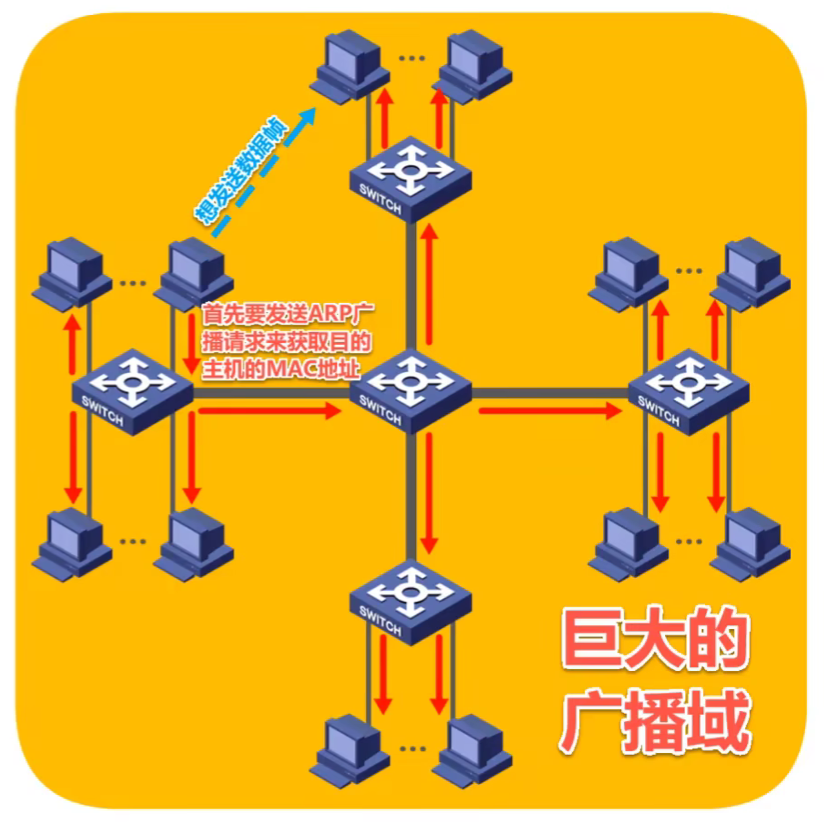

那么我们改如何减小广播域呢？

首先，使用路由器可以隔离广播域，因为它工作在网络体系结构的网络层，默认情况下不对广播数据包进行转发。

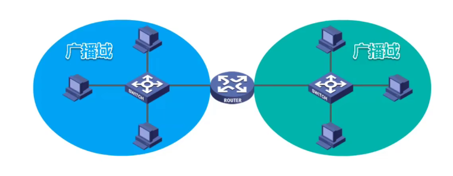

